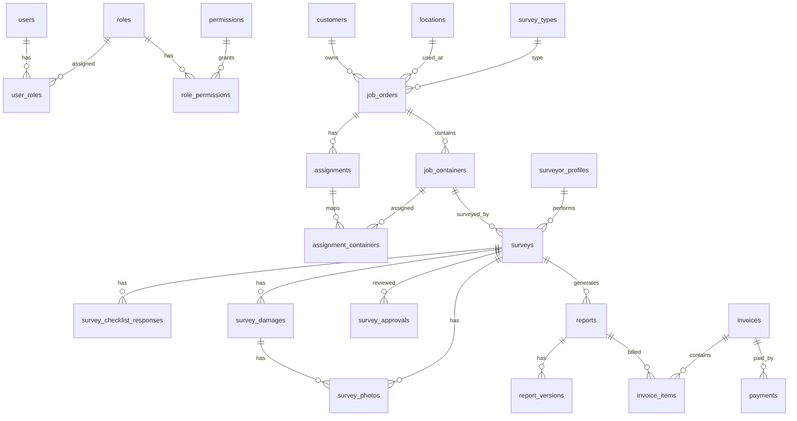

# database_schema.md — Container Survey Management System

**Produk:** Container Survey Management System  
**Unit/Perusahaan:** GIFT / PT Global Inspeksi Sertifikasi Group  
**Versi Dokumen:** 1.0  
**Tanggal:** 24 Juni 2026  
**Status:** Draft teknis database untuk development  
**Basis PRD:** `prd.md` versi 1.0  

---

## 1. Tujuan Dokumen

Dokumen ini menjelaskan rancangan database untuk aplikasi **Container Survey Management System**. Database dirancang untuk mendukung tahap awal Web Application lengkap untuk semua role, termasuk Surveyor Web Module, dan siap digunakan kembali oleh Mobile Application Surveyor pada fase lanjutan.

Database harus mendukung proses utama berikut:

1. User, role, dan permission.
2. Company profile dan numbering dokumen.
3. Master data operasional.
4. Master CEDEX.
5. Job order dan daftar container.
6. Assignment surveyor.
7. Survey, checklist, damage, foto, dan approval.
8. Report PDF dan versioning.
9. Finance, invoice, payment, dan outstanding.
10. Audit log, notification, dan file storage metadata.
11. Persiapan future mobile app: offline sync, local cache, GPS, watermark, dan background upload.

---

## 2. Database Engine dan Konvensi

### 2.1 Database Engine

Rekomendasi database:

```text
MySQL 16+
```

Alasan:

1. Cocok untuk data relasional kompleks.
2. Mendukung constraint dan index yang kuat.
3. Mendukung JSON untuk metadata fleksibel.
4. Cocok untuk reporting dan filtering.
5. Stabil untuk backend Go.

---

### 2.2 Primary Key Strategy

Gunakan UUID sebagai primary key untuk seluruh tabel utama.

```sql
id UUID PRIMARY KEY DEFAULT UUID()
```

Extension MySQL yang diperlukan:

```sql

```

Alasan menggunakan UUID:

1. Aman untuk API publik/internal.
2. Tidak mudah ditebak seperti auto increment.
3. Lebih siap untuk mobile sync/offline di masa depan.
4. Cocok untuk sistem terdistribusi.

---

### 2.3 Naming Convention

| Item | Format | Contoh |
|---|---|---|
| Table | snake_case plural | `job_orders` |
| Column | snake_case | `job_order_no` |
| Primary Key | `id` | `id UUID` |
| Foreign Key | `{entity}_id` | `customer_id` |
| Timestamp | `created_at`, `updated_at`, `deleted_at` | `created_at` |
| Boolean | prefix `is_` / `has_` | `is_active` |
| Enum value | lowercase snake_case | `not_started` |

---

### 2.4 Common Columns

Sebagian besar tabel transaksi dan master menggunakan kolom umum berikut:

| Column | Type | Keterangan |
|---|---|---|
| `id` | UUID | Primary key |
| `created_at` | DATETIME(6) | Waktu pembuatan |
| `updated_at` | DATETIME(6) | Waktu update terakhir |
| `deleted_at` | DATETIME(6) NULL | Soft delete |
| `created_by` | UUID NULL | User pembuat |
| `updated_by` | UUID NULL | User terakhir update |

Catatan:

1. Tabel audit log tidak boleh soft delete.
2. Tabel payment dan report final tidak boleh hard delete.
3. Soft delete digunakan untuk menjaga histori dan audit.

---

## 3. Daftar Enum Database

Enum dapat dibuat sebagai MySQL enum type atau menggunakan `TEXT` + `CHECK constraint`. Untuk fleksibilitas development awal, direkomendasikan memakai `TEXT` + `CHECK constraint`, kecuali status yang sangat stabil.

### 3.1 User dan Role

```text
user_status: active, inactive, suspended
```

### 3.2 Master Status

```text
master_status: active, inactive
```

### 3.3 Location Type

```text
location_type: depot, yard, port, warehouse, factory, customer_site, other
```

### 3.4 Job Priority

```text
job_priority: normal, urgent
```

### 3.5 Job Order Status

```text
job_order_status:
- draft
- assigned
- in_progress
- all_survey_submitted
- all_survey_approved
- report_generated
- ready_to_invoice
- invoiced
- paid
- closed
- cancelled
```

### 3.6 Job Container Status

```text
job_container_status:
- not_started
- assigned
- in_progress
- draft
- submitted
- need_revision
- approved
- reported
- invoiced
- closed
- cancelled
```

### 3.7 Assignment Status

```text
assignment_status:
- assigned
- accepted
- in_progress
- completed
- cancelled
```

### 3.8 Survey Status

```text
survey_status:
- draft
- submitted
- need_revision
- approved
- rejected
- report_generated
- cancelled
```

### 3.9 Cargo Status

```text
cargo_status: empty, laden, unknown
```

### 3.10 CSC Plate Status

```text
csc_plate_status: available, missing, unreadable, not_checked
```

### 3.11 Door Status

```text
door_status: open, closed, locked, cannot_open, not_checked
```

### 3.12 General Condition / Survey Result

```text
survey_result:
- sound
- damage
- dirty
- wet
- odor
- need_repair
- cargo_worthy
- not_cargo_worthy
- pending_review
```

### 3.13 Checklist Value

```text
checklist_value:
- yes
- no
- ok
- not_ok
- pass
- fail
- clean
- dirty
- not_checked
- not_applicable
```

### 3.14 Container Face

```text
container_face:
- left
- right
- front
- door
- roof
- floor
- understructure
```

### 3.15 Damage Severity

```text
damage_severity: minor, major, critical
```

### 3.16 Measurement Unit

```text
measurement_unit: mm, cm, m
```

### 3.17 Photo Type

```text
photo_type: general, damage, document
```

### 3.18 Review Decision

```text
review_decision: approved, need_revision, rejected
```

### 3.19 Report Type

```text
report_type:
- job_order
- assignment_sheet
- survey_sheet
- inspection_report
- damage_report
- eir
- photo_attachment
- invoice
- payment_receipt
```

### 3.20 Report Status

```text
report_status: draft, generated, finalized, superseded, cancelled
```

### 3.21 Invoice Status

```text
invoice_status:
- draft
- issued
- unpaid
- partial_paid
- paid
- overdue
- cancelled
```

### 3.22 Payment Method

```text
payment_method: cash, bank_transfer, giro, virtual_account, other
```

### 3.23 Notification Status

```text
notification_status: unread, read, archived
```

### 3.24 File Visibility

```text
file_visibility: private, internal, public_token
```

---

## 4. Gambaran Relasi Utama



---

## 5. Modul User, Role, dan Permission

### 5.1 `users`

Menyimpan akun login semua pengguna.

| Column | Type | Constraint | Keterangan |
|---|---|---|---|
| `id` | UUID | PK | ID user |
| `name` | VARCHAR(150) | NOT NULL | Nama user |
| `email` | VARCHAR(150) | UNIQUE, NOT NULL | Email login |
| `username` | VARCHAR(80) | UNIQUE NULL | Username opsional |
| `password_hash` | TEXT | NOT NULL | Password hash |
| `phone` | VARCHAR(30) | NULL | Nomor HP |
| `avatar_file_id` | UUID | FK NULL | File foto profil |
| `status` | VARCHAR(30) | NOT NULL DEFAULT `active` | active/inactive/suspended |
| `last_login_at` | DATETIME(6) | NULL | Login terakhir |
| `password_changed_at` | DATETIME(6) | NULL | Waktu ganti password |
| `created_at` | DATETIME(6) | NOT NULL | Timestamp |
| `updated_at` | DATETIME(6) | NOT NULL | Timestamp |
| `deleted_at` | DATETIME(6) | NULL | Soft delete |

Index:

```sql
CREATE UNIQUE INDEX idx_users_email ON users(email);
CREATE UNIQUE INDEX idx_users_username ON users(username);
CREATE INDEX idx_users_status ON users(status);
```

---

### 5.2 `roles`

Menyimpan role aplikasi.

| Column | Type | Constraint | Keterangan |
|---|---|---|---|
| `id` | UUID | PK | ID role |
| `code` | VARCHAR(50) | UNIQUE, NOT NULL | super_admin/admin/surveyor/supervisor/finance/management |
| `name` | VARCHAR(100) | NOT NULL | Nama role |
| `description` | TEXT | NULL | Deskripsi |
| `is_system_role` | TINYINT(1) | NOT NULL DEFAULT false | Role bawaan sistem |
| `created_at` | DATETIME(6) | NOT NULL | Timestamp |
| `updated_at` | DATETIME(6) | NOT NULL | Timestamp |

Data awal:

```text
super_admin
admin
surveyor
supervisor
finance
management
```

---

### 5.3 `permissions`

Menyimpan daftar permission granular.

| Column | Type | Constraint | Keterangan |
|---|---|---|---|
| `id` | UUID | PK | ID permission |
| `code` | VARCHAR(120) | UNIQUE, NOT NULL | Contoh: `job.create` |
| `module` | VARCHAR(80) | NOT NULL | Modul |
| `action` | VARCHAR(50) | NOT NULL | view/create/update/delete/approve/export |
| `description` | TEXT | NULL | Deskripsi |

Contoh permission:

```text
user.view
user.create
role.manage
customer.view
customer.create
job.create
job.assign
survey.fill
survey.submit
survey.review
survey.approve
finance.invoice_create
payment.create
audit.view
```

---

### 5.4 `user_roles`

Relasi many-to-many user dan role.

| Column | Type | Constraint |
|---|---|---|
| `id` | UUID | PK |
| `user_id` | UUID | FK users(id), NOT NULL |
| `role_id` | UUID | FK roles(id), NOT NULL |
| `created_at` | DATETIME(6) | NOT NULL |

Constraint:

```sql
UNIQUE(user_id, role_id)
```

---

### 5.5 `role_permissions`

Relasi many-to-many role dan permission.

| Column | Type | Constraint |
|---|---|---|
| `id` | UUID | PK |
| `role_id` | UUID | FK roles(id), NOT NULL |
| `permission_id` | UUID | FK permissions(id), NOT NULL |
| `created_at` | DATETIME(6) | NOT NULL |

Constraint:

```sql
UNIQUE(role_id, permission_id)
```

---

### 5.6 `refresh_tokens`

Menyimpan refresh token untuk web dan future mobile.

| Column | Type | Constraint | Keterangan |
|---|---|---|---|
| `id` | UUID | PK | ID token |
| `user_id` | UUID | FK users(id), NOT NULL | User |
| `token_hash` | TEXT | NOT NULL | Hash token |
| `device_name` | VARCHAR(150) | NULL | Nama device/browser |
| `ip_address` | VARCHAR(45) | NULL | IP |
| `user_agent` | TEXT | NULL | User agent |
| `expires_at` | DATETIME(6) | NOT NULL | Expired |
| `revoked_at` | DATETIME(6) | NULL | Waktu revoke |
| `created_at` | DATETIME(6) | NOT NULL | Dibuat |

Index:

```sql
CREATE INDEX idx_refresh_tokens_user ON refresh_tokens(user_id);
CREATE INDEX idx_refresh_tokens_expires ON refresh_tokens(expires_at);
```

---

## 6. Modul Company dan Setting

### 6.1 `company_profiles`

Menyimpan profil perusahaan untuk report, invoice, dan identitas sistem.

| Column | Type | Constraint | Keterangan |
|---|---|---|---|
| `id` | UUID | PK | ID |
| `company_name` | VARCHAR(200) | NOT NULL | Nama perusahaan |
| `brand_name` | VARCHAR(100) | NULL | GIFT/GIS |
| `address` | TEXT | NULL | Alamat |
| `phone` | VARCHAR(50) | NULL | Telepon |
| `email` | VARCHAR(150) | NULL | Email |
| `website` | VARCHAR(150) | NULL | Website |
| `tax_no` | VARCHAR(80) | NULL | NPWP |
| `logo_file_id` | UUID | FK file_objects(id) NULL | Logo |
| `default_signature_file_id` | UUID | FK file_objects(id) NULL | Tanda tangan default |
| `is_active` | TINYINT(1) | NOT NULL DEFAULT true | Aktif |
| `created_at` | DATETIME(6) | NOT NULL | Timestamp |
| `updated_at` | DATETIME(6) | NOT NULL | Timestamp |

Aturan:

1. Minimal satu company profile aktif.
2. Untuk MVP single company, hanya satu row aktif.

---

### 6.2 `numbering_settings`

Menyimpan format nomor dokumen.

| Column | Type | Constraint | Keterangan |
|---|---|---|---|
| `id` | UUID | PK | ID |
| `document_type` | VARCHAR(50) | NOT NULL | job_order/assignment/survey/report/eir/invoice/payment_receipt |
| `prefix` | VARCHAR(20) | NOT NULL DEFAULT 'GIFT' | Prefix |
| `doc_code` | VARCHAR(20) | NOT NULL | JO/ASG/SVY/RPT/EIR/INV/RCP |
| `year_format` | VARCHAR(10) | NOT NULL DEFAULT 'YYYY' | Format tahun |
| `running_digits` | INT | NOT NULL DEFAULT 6 | Jumlah digit running |
| `reset_period` | VARCHAR(20) | NOT NULL DEFAULT 'yearly' | yearly/monthly/never |
| `format_preview` | VARCHAR(100) | NULL | Preview |
| `is_active` | TINYINT(1) | NOT NULL DEFAULT true | Status |
| `created_at` | DATETIME(6) | NOT NULL | Timestamp |
| `updated_at` | DATETIME(6) | NOT NULL | Timestamp |

Constraint:

```sql
UNIQUE(document_type, is_active) WHERE is_active = true
```

---

### 6.3 `numbering_sequences`

Menyimpan counter nomor dokumen per periode.

| Column | Type | Constraint | Keterangan |
|---|---|---|---|
| `id` | UUID | PK | ID |
| `document_type` | VARCHAR(50) | NOT NULL | Jenis dokumen |
| `period_key` | VARCHAR(20) | NOT NULL | Contoh: 2026 / 202606 |
| `last_number` | BIGINT | NOT NULL DEFAULT 0 | Nomor terakhir |
| `created_at` | DATETIME(6) | NOT NULL | Timestamp |
| `updated_at` | DATETIME(6) | NOT NULL | Timestamp |

Constraint:

```sql
UNIQUE(document_type, period_key)
```

Aturan:

1. Generate nomor harus transactional/atomic.
2. Nomor yang batal tidak boleh digunakan ulang.

---

### 6.4 `system_settings`

Menyimpan setting global fleksibel.

| Column | Type | Constraint | Keterangan |
|---|---|---|---|
| `id` | UUID | PK | ID |
| `setting_key` | VARCHAR(120) | UNIQUE, NOT NULL | Key |
| `setting_value` | JSON | NOT NULL | Value fleksibel |
| `description` | TEXT | NULL | Deskripsi |
| `updated_by` | UUID | FK users(id) NULL | User |
| `updated_at` | DATETIME(6) | NOT NULL | Timestamp |

Contoh:

```text
survey.require_photo_for_minor_damage = true
survey.require_seal_no_when_laden = true
report.enable_qr_validation = true
```

---

## 7. Modul File Storage Metadata

### 7.1 `file_objects`

Metadata file yang disimpan di MinIO/S3. File binary tidak disimpan di database.

| Column | Type | Constraint | Keterangan |
|---|---|---|---|
| `id` | UUID | PK | ID file |
| `bucket_name` | VARCHAR(100) | NOT NULL | Nama bucket |
| `object_key` | TEXT | NOT NULL | Path object storage |
| `original_file_name` | VARCHAR(255) | NULL | Nama asli |
| `mime_type` | VARCHAR(100) | NULL | MIME |
| `file_size` | BIGINT | NULL | Byte |
| `checksum_sha256` | VARCHAR(128) | NULL | Checksum |
| `visibility` | VARCHAR(30) | NOT NULL DEFAULT 'private' | private/internal/public_token |
| `public_token` | VARCHAR(120) | UNIQUE NULL | Token akses public terbatas |
| `uploaded_by` | UUID | FK users(id) NULL | Uploader |
| `uploaded_at` | DATETIME(6) | NOT NULL | Waktu upload |
| `deleted_at` | DATETIME(6) | NULL | Soft delete |

Index:

```sql
CREATE INDEX idx_file_objects_object_key ON file_objects(object_key);
CREATE INDEX idx_file_objects_uploaded_by ON file_objects(uploaded_by);
```

---

## 8. Modul Master Data Operasional

### 8.1 `customers`

| Column | Type | Constraint | Keterangan |
|---|---|---|---|
| `id` | UUID | PK | ID customer |
| `customer_code` | VARCHAR(50) | UNIQUE, NOT NULL | Kode customer |
| `customer_name` | VARCHAR(200) | NOT NULL | Nama customer |
| `address` | TEXT | NULL | Alamat |
| `npwp` | VARCHAR(80) | NULL | NPWP |
| `pic_name` | VARCHAR(150) | NULL | Nama PIC |
| `pic_phone` | VARCHAR(50) | NULL | HP PIC |
| `pic_email` | VARCHAR(150) | NULL | Email PIC |
| `billing_address` | TEXT | NULL | Alamat tagihan |
| `payment_term_days` | INT | NULL | Termin pembayaran |
| `status` | VARCHAR(30) | NOT NULL DEFAULT 'active' | active/inactive |
| `created_by` | UUID | FK users(id) NULL | Pembuat |
| `updated_by` | UUID | FK users(id) NULL | Update terakhir |
| `created_at` | DATETIME(6) | NOT NULL | Timestamp |
| `updated_at` | DATETIME(6) | NOT NULL | Timestamp |
| `deleted_at` | DATETIME(6) | NULL | Soft delete |

Index:

```sql
CREATE INDEX idx_customers_name ON customers(customer_name);
CREATE INDEX idx_customers_status ON customers(status);
```

---

### 8.2 `locations`

| Column | Type | Constraint | Keterangan |
|---|---|---|---|
| `id` | UUID | PK | ID location |
| `location_code` | VARCHAR(50) | UNIQUE, NOT NULL | Kode lokasi |
| `location_name` | VARCHAR(200) | NOT NULL | Nama lokasi |
| `location_type` | VARCHAR(50) | NOT NULL | depot/yard/port/etc |
| `address` | TEXT | NULL | Alamat |
| `city` | VARCHAR(100) | NULL | Kota |
| `gps_latitude` | DECIMAL(10,7) | NULL | Latitude |
| `gps_longitude` | DECIMAL(10,7) | NULL | Longitude |
| `pic_name` | VARCHAR(150) | NULL | PIC lokasi |
| `pic_phone` | VARCHAR(50) | NULL | Kontak |
| `status` | VARCHAR(30) | NOT NULL DEFAULT 'active' | Status |
| `created_at` | DATETIME(6) | NOT NULL | Timestamp |
| `updated_at` | DATETIME(6) | NOT NULL | Timestamp |
| `deleted_at` | DATETIME(6) | NULL | Soft delete |

Index:

```sql
CREATE INDEX idx_locations_name ON locations(location_name);
CREATE INDEX idx_locations_type ON locations(location_type);
```

---

### 8.3 `surveyor_profiles`

Menyimpan data khusus surveyor yang terkait dengan user login.

| Column | Type | Constraint | Keterangan |
|---|---|---|---|
| `id` | UUID | PK | ID surveyor profile |
| `user_id` | UUID | FK users(id), UNIQUE, NOT NULL | User login |
| `surveyor_code` | VARCHAR(50) | UNIQUE, NOT NULL | Kode surveyor |
| `full_name` | VARCHAR(150) | NOT NULL | Nama surveyor |
| `phone` | VARCHAR(50) | NULL | Nomor HP |
| `area` | VARCHAR(150) | NULL | Area kerja |
| `signature_file_id` | UUID | FK file_objects(id) NULL | Tanda tangan |
| `status` | VARCHAR(30) | NOT NULL DEFAULT 'active' | Status |
| `created_at` | DATETIME(6) | NOT NULL | Timestamp |
| `updated_at` | DATETIME(6) | NOT NULL | Timestamp |
| `deleted_at` | DATETIME(6) | NULL | Soft delete |

---

### 8.4 `container_types`

| Column | Type | Constraint | Keterangan |
|---|---|---|---|
| `id` | UUID | PK | ID |
| `code` | VARCHAR(30) | UNIQUE, NOT NULL | 20GP/40GP/40HC |
| `iso_code` | VARCHAR(20) | NULL | 22G1/45G1 |
| `size` | VARCHAR(50) | NOT NULL | 20 Feet/40 Feet |
| `type_name` | VARCHAR(100) | NOT NULL | General Purpose/Reefer |
| `description` | TEXT | NULL | Deskripsi |
| `status` | VARCHAR(30) | NOT NULL DEFAULT 'active' | Status |
| `created_at` | DATETIME(6) | NOT NULL | Timestamp |
| `updated_at` | DATETIME(6) | NOT NULL | Timestamp |

---

### 8.5 `survey_types`

| Column | Type | Constraint | Keterangan |
|---|---|---|---|
| `id` | UUID | PK | ID |
| `code` | VARCHAR(30) | UNIQUE, NOT NULL | GI/GO/DS/CW |
| `name` | VARCHAR(150) | NOT NULL | Nama survey |
| `description` | TEXT | NULL | Deskripsi |
| `requires_eir` | TINYINT(1) | NOT NULL DEFAULT false | Apakah EIR diperlukan |
| `requires_light_test` | TINYINT(1) | NOT NULL DEFAULT false | Apakah light test wajib |
| `requires_cargo_worthy_result` | TINYINT(1) | NOT NULL DEFAULT false | Apakah result cargo worthy wajib |
| `status` | VARCHAR(30) | NOT NULL DEFAULT 'active' | Status |
| `created_at` | DATETIME(6) | NOT NULL | Timestamp |
| `updated_at` | DATETIME(6) | NOT NULL | Timestamp |

Data awal:

```text
GI, GO, DS, CW, CL, ONH, OFH, STUF, STRP, PTI
```

---

## 9. Modul Master CEDEX

### 9.1 `cedex_locations`

| Column | Type | Constraint | Keterangan |
|---|---|---|---|
| `id` | UUID | PK | ID |
| `code` | VARCHAR(30) | NOT NULL | L1/R1/D1/T1 |
| `face` | VARCHAR(50) | NOT NULL | left/right/front/door/roof/floor/understructure |
| `grid_code` | VARCHAR(30) | NOT NULL | Kode grid UI |
| `cedex_mapping_code` | VARCHAR(50) | NULL | Mapping CEDEX teknis |
| `container_size` | VARCHAR(20) | NULL | all/20/40/45 |
| `description` | TEXT | NULL | Deskripsi |
| `display_order` | INT | NOT NULL DEFAULT 0 | Urutan tampilan |
| `status` | VARCHAR(30) | NOT NULL DEFAULT 'active' | Status |
| `created_at` | DATETIME(6) | NOT NULL | Timestamp |
| `updated_at` | DATETIME(6) | NOT NULL | Timestamp |

Constraint:

```sql
UNIQUE(code, face, COALESCE(container_size, 'all'))
```

Index:

```sql
CREATE INDEX idx_cedex_locations_face ON cedex_locations(face);
```

---

### 9.2 `cedex_components`

| Column | Type | Constraint | Keterangan |
|---|---|---|---|
| `id` | UUID | PK | ID |
| `code` | VARCHAR(30) | UNIQUE, NOT NULL | SP/RP/DG |
| `component_name` | VARCHAR(150) | NOT NULL | Side Panel |
| `description` | TEXT | NULL | Deskripsi |
| `status` | VARCHAR(30) | NOT NULL DEFAULT 'active' | Status |
| `created_at` | DATETIME(6) | NOT NULL | Timestamp |
| `updated_at` | DATETIME(6) | NOT NULL | Timestamp |

---

### 9.3 `cedex_damages`

| Column | Type | Constraint | Keterangan |
|---|---|---|---|
| `id` | UUID | PK | ID |
| `code` | VARCHAR(30) | UNIQUE, NOT NULL | DT/HL/CR |
| `damage_name` | VARCHAR(150) | NOT NULL | Dent/Hole |
| `description` | TEXT | NULL | Deskripsi |
| `default_severity` | VARCHAR(30) | NULL | minor/major/critical |
| `status` | VARCHAR(30) | NOT NULL DEFAULT 'active' | Status |
| `created_at` | DATETIME(6) | NOT NULL | Timestamp |
| `updated_at` | DATETIME(6) | NOT NULL | Timestamp |

---

### 9.4 `cedex_repairs`

| Column | Type | Constraint | Keterangan |
|---|---|---|---|
| `id` | UUID | PK | ID |
| `code` | VARCHAR(30) | UNIQUE, NOT NULL | ST/WD/PT/RP |
| `repair_name` | VARCHAR(150) | NOT NULL | Straighten/Weld |
| `description` | TEXT | NULL | Deskripsi |
| `status` | VARCHAR(30) | NOT NULL DEFAULT 'active' | Status |
| `created_at` | DATETIME(6) | NOT NULL | Timestamp |
| `updated_at` | DATETIME(6) | NOT NULL | Timestamp |

---

### 9.5 `cedex_materials`

| Column | Type | Constraint | Keterangan |
|---|---|---|---|
| `id` | UUID | PK | ID |
| `code` | VARCHAR(30) | UNIQUE, NOT NULL | STL/PLY/RUB |
| `material_name` | VARCHAR(150) | NOT NULL | Steel/Plywood |
| `description` | TEXT | NULL | Deskripsi |
| `status` | VARCHAR(30) | NOT NULL DEFAULT 'active' | Status |
| `created_at` | DATETIME(6) | NOT NULL | Timestamp |
| `updated_at` | DATETIME(6) | NOT NULL | Timestamp |

---

### 9.6 `responsibility_codes`

| Column | Type | Constraint | Keterangan |
|---|---|---|---|
| `id` | UUID | PK | ID |
| `code` | VARCHAR(30) | UNIQUE, NOT NULL | O/U/S/CAR |
| `responsibility_name` | VARCHAR(150) | NOT NULL | Owner/User/Carrier |
| `description` | TEXT | NULL | Deskripsi |
| `status` | VARCHAR(30) | NOT NULL DEFAULT 'active' | Status |
| `created_at` | DATETIME(6) | NOT NULL | Timestamp |
| `updated_at` | DATETIME(6) | NOT NULL | Timestamp |

---

## 10. Modul Checklist Template

Checklist dibuat fleksibel agar berbeda per survey type.

### 10.1 `checklist_templates`

| Column | Type | Constraint | Keterangan |
|---|---|---|---|
| `id` | UUID | PK | ID |
| `survey_type_id` | UUID | FK survey_types(id), NULL | Jika NULL berlaku umum |
| `template_name` | VARCHAR(150) | NOT NULL | Nama template |
| `description` | TEXT | NULL | Deskripsi |
| `is_default` | TINYINT(1) | NOT NULL DEFAULT false | Default |
| `status` | VARCHAR(30) | NOT NULL DEFAULT 'active' | Status |
| `created_at` | DATETIME(6) | NOT NULL | Timestamp |
| `updated_at` | DATETIME(6) | NOT NULL | Timestamp |

---

### 10.2 `checklist_template_items`

| Column | Type | Constraint | Keterangan |
|---|---|---|---|
| `id` | UUID | PK | ID |
| `template_id` | UUID | FK checklist_templates(id), NOT NULL | Template |
| `item_code` | VARCHAR(80) | NOT NULL | Kode item |
| `item_label` | VARCHAR(200) | NOT NULL | Label checklist |
| `input_type` | VARCHAR(50) | NOT NULL | yes_no/ok_not_ok/pass_fail/select/text |
| `allowed_values` | JSON | NULL | List opsi |
| `is_required` | TINYINT(1) | NOT NULL DEFAULT true | Wajib |
| `is_critical` | TINYINT(1) | NOT NULL DEFAULT false | Critical |
| `display_order` | INT | NOT NULL DEFAULT 0 | Urutan |
| `active` | TINYINT(1) | NOT NULL DEFAULT true | Aktif |

Constraint:

```sql
UNIQUE(template_id, item_code)
```

Contoh `allowed_values`:

```json
["yes", "no", "not_applicable"]
```

---

## 11. Modul Job Order

### 11.1 `job_orders`

| Column | Type | Constraint | Keterangan |
|---|---|---|---|
| `id` | UUID | PK | ID job |
| `job_order_no` | VARCHAR(80) | UNIQUE, NOT NULL | Nomor job |
| `job_date` | DATE | NOT NULL | Tanggal job |
| `customer_id` | UUID | FK customers(id), NOT NULL | Customer |
| `survey_type_id` | UUID | FK survey_types(id), NOT NULL | Jenis survey |
| `location_id` | UUID | FK locations(id), NOT NULL | Lokasi |
| `pic_customer_name` | VARCHAR(150) | NULL | PIC customer |
| `pic_customer_phone` | VARCHAR(50) | NULL | HP PIC |
| `pic_customer_email` | VARCHAR(150) | NULL | Email PIC |
| `reference_no` | VARCHAR(100) | NULL | Referensi |
| `booking_no` | VARCHAR(100) | NULL | Booking |
| `do_no` | VARCHAR(100) | NULL | DO |
| `bl_no` | VARCHAR(100) | NULL | BL |
| `vessel` | VARCHAR(150) | NULL | Vessel |
| `voyage` | VARCHAR(100) | NULL | Voyage |
| `trucking_company` | VARCHAR(150) | NULL | Trucking |
| `priority` | VARCHAR(30) | NOT NULL DEFAULT 'normal' | normal/urgent |
| `deadline` | DATETIME(6) | NULL | Deadline |
| `instruction` | TEXT | NULL | Instruksi |
| `status` | VARCHAR(50) | NOT NULL DEFAULT 'draft' | Status job |
| `cancel_reason` | TEXT | NULL | Alasan cancel |
| `cancelled_at` | DATETIME(6) | NULL | Waktu cancel |
| `cancelled_by` | UUID | FK users(id) NULL | User cancel |
| `created_by` | UUID | FK users(id) NULL | Pembuat |
| `updated_by` | UUID | FK users(id) NULL | Update |
| `created_at` | DATETIME(6) | NOT NULL | Timestamp |
| `updated_at` | DATETIME(6) | NOT NULL | Timestamp |
| `deleted_at` | DATETIME(6) | NULL | Soft delete |

Index:

```sql
CREATE UNIQUE INDEX idx_job_orders_no ON job_orders(job_order_no);
CREATE INDEX idx_job_orders_customer ON job_orders(customer_id);
CREATE INDEX idx_job_orders_status ON job_orders(status);
CREATE INDEX idx_job_orders_date ON job_orders(job_date);
CREATE INDEX idx_job_orders_survey_type ON job_orders(survey_type_id);
```

---

### 11.2 `job_containers`

| Column | Type | Constraint | Keterangan |
|---|---|---|---|
| `id` | UUID | PK | ID job container |
| `job_order_id` | UUID | FK job_orders(id), NOT NULL | Relasi job |
| `container_no` | VARCHAR(20) | NOT NULL | Nomor container |
| `owner_code` | VARCHAR(4) | NULL | 4 huruf awal jika diparsing |
| `serial_number` | VARCHAR(10) | NULL | Serial |
| `check_digit` | VARCHAR(2) | NULL | Digit akhir |
| `check_digit_status` | VARCHAR(30) | NOT NULL DEFAULT 'not_checked' | valid/invalid/not_checked/override |
| `check_digit_override_reason` | TEXT | NULL | Alasan override |
| `container_type_id` | UUID | FK container_types(id) NULL | Type |
| `iso_type_code` | VARCHAR(20) | NULL | ISO code |
| `seal_no` | VARCHAR(100) | NULL | Seal |
| `cargo_status` | VARCHAR(30) | NOT NULL DEFAULT 'unknown' | empty/laden/unknown |
| `gross_weight` | DECIMAL(12,2) | NULL | Berat kotor |
| `tare_weight` | DECIMAL(12,2) | NULL | Tare |
| `payload` | DECIMAL(12,2) | NULL | Payload |
| `manufacture_date` | DATE | NULL | Tanggal produksi |
| `csc_plate_status` | VARCHAR(30) | NULL | CSC status |
| `truck_no` | VARCHAR(80) | NULL | Nomor truk |
| `driver_name` | VARCHAR(150) | NULL | Driver |
| `remark` | TEXT | NULL | Catatan |
| `status` | VARCHAR(50) | NOT NULL DEFAULT 'not_started' | Status container |
| `created_at` | DATETIME(6) | NOT NULL | Timestamp |
| `updated_at` | DATETIME(6) | NOT NULL | Timestamp |
| `deleted_at` | DATETIME(6) | NULL | Soft delete |

Constraint:

```sql
UNIQUE(job_order_id, container_no) WHERE deleted_at IS NULL
```

Index:

```sql
CREATE INDEX idx_job_containers_job ON job_containers(job_order_id);
CREATE INDEX idx_job_containers_container_no ON job_containers(container_no);
CREATE INDEX idx_job_containers_status ON job_containers(status);
```

---

### 11.3 `container_import_batches`

Mencatat aktivitas import Excel.

| Column | Type | Constraint | Keterangan |
|---|---|---|---|
| `id` | UUID | PK | ID batch |
| `job_order_id` | UUID | FK job_orders(id), NOT NULL | Job |
| `file_id` | UUID | FK file_objects(id) NULL | File Excel |
| `total_rows` | INT | NOT NULL DEFAULT 0 | Total row |
| `success_rows` | INT | NOT NULL DEFAULT 0 | Berhasil |
| `failed_rows` | INT | NOT NULL DEFAULT 0 | Gagal |
| `status` | VARCHAR(30) | NOT NULL DEFAULT 'processed' | processed/failed/partial |
| `error_summary` | JSON | NULL | Error import |
| `imported_by` | UUID | FK users(id) NULL | User |
| `imported_at` | DATETIME(6) | NOT NULL | Waktu |

---

## 12. Modul Assignment Surveyor

### 12.1 `assignments`

| Column | Type | Constraint | Keterangan |
|---|---|---|---|
| `id` | UUID | PK | ID assignment |
| `assignment_no` | VARCHAR(80) | UNIQUE, NOT NULL | Nomor assignment |
| `job_order_id` | UUID | FK job_orders(id), NOT NULL | Job |
| `surveyor_id` | UUID | FK surveyor_profiles(id), NOT NULL | Surveyor |
| `assigned_by` | UUID | FK users(id), NOT NULL | Admin |
| `assigned_at` | DATETIME(6) | NOT NULL | Waktu assign |
| `start_date` | DATETIME(6) | NULL | Jadwal mulai |
| `due_date` | DATETIME(6) | NULL | Deadline |
| `instruction` | TEXT | NULL | Instruksi |
| `status` | VARCHAR(50) | NOT NULL DEFAULT 'assigned' | Status |
| `cancel_reason` | TEXT | NULL | Alasan cancel |
| `created_at` | DATETIME(6) | NOT NULL | Timestamp |
| `updated_at` | DATETIME(6) | NOT NULL | Timestamp |

Index:

```sql
CREATE INDEX idx_assignments_job ON assignments(job_order_id);
CREATE INDEX idx_assignments_surveyor ON assignments(surveyor_id);
CREATE INDEX idx_assignments_status ON assignments(status);
```

---

### 12.2 `assignment_containers`

Relasi assignment dengan container. Dibuat agar satu job bisa dibagi ke beberapa surveyor.

| Column | Type | Constraint | Keterangan |
|---|---|---|---|
| `id` | UUID | PK | ID |
| `assignment_id` | UUID | FK assignments(id), NOT NULL | Assignment |
| `job_container_id` | UUID | FK job_containers(id), NOT NULL | Container |
| `assigned_at` | DATETIME(6) | NOT NULL | Waktu assign |
| `unassigned_at` | DATETIME(6) | NULL | Jika dicabut |
| `unassigned_reason` | TEXT | NULL | Alasan |

Constraint:

```sql
UNIQUE(assignment_id, job_container_id)
```

Aturan:

1. Container aktif sebaiknya hanya ditugaskan ke satu surveyor pada satu waktu.
2. Reassignment harus menutup assignment lama dengan `unassigned_at`, lalu membuat row baru.

---

## 13. Modul Survey

### 13.1 `surveys`

Satu survey dibuat per container dalam job dan survey type.

| Column | Type | Constraint | Keterangan |
|---|---|---|---|
| `id` | UUID | PK | ID survey |
| `survey_no` | VARCHAR(80) | UNIQUE, NOT NULL | Nomor survey |
| `job_order_id` | UUID | FK job_orders(id), NOT NULL | Job |
| `job_container_id` | UUID | FK job_containers(id), NOT NULL | Container |
| `assignment_id` | UUID | FK assignments(id) NULL | Assignment |
| `surveyor_id` | UUID | FK surveyor_profiles(id), NOT NULL | Surveyor |
| `survey_type_id` | UUID | FK survey_types(id), NOT NULL | Survey type |
| `status` | VARCHAR(50) | NOT NULL DEFAULT 'draft' | Status survey |
| `survey_result` | VARCHAR(50) | NULL | Result akhir/sementara |
| `system_recommendation_result` | VARCHAR(50) | NULL | Rekomendasi sistem |
| `started_at` | DATETIME(6) | NULL | Mulai survey |
| `submitted_at` | DATETIME(6) | NULL | Submit |
| `approved_at` | DATETIME(6) | NULL | Approve |
| `rejected_at` | DATETIME(6) | NULL | Reject |
| `current_revision_no` | INT | NOT NULL DEFAULT 0 | Revisi survey |
| `created_at` | DATETIME(6) | NOT NULL | Timestamp |
| `updated_at` | DATETIME(6) | NOT NULL | Timestamp |
| `deleted_at` | DATETIME(6) | NULL | Soft delete |

Constraint:

```sql
UNIQUE(job_container_id, survey_type_id) WHERE deleted_at IS NULL
```

Index:

```sql
CREATE UNIQUE INDEX idx_surveys_no ON surveys(survey_no);
CREATE INDEX idx_surveys_job ON surveys(job_order_id);
CREATE INDEX idx_surveys_container ON surveys(job_container_id);
CREATE INDEX idx_surveys_surveyor ON surveys(surveyor_id);
CREATE INDEX idx_surveys_status ON surveys(status);
CREATE INDEX idx_surveys_submitted_at ON surveys(submitted_at);
```

---

### 13.2 `survey_general_infos`

Memisahkan data general survey agar table `surveys` tidak terlalu lebar.

| Column | Type | Constraint | Keterangan |
|---|---|---|---|
| `id` | UUID | PK | ID |
| `survey_id` | UUID | FK surveys(id), UNIQUE, NOT NULL | Survey |
| `container_no` | VARCHAR(20) | NOT NULL | Snapshot container no |
| `container_type_id` | UUID | FK container_types(id) NULL | Snapshot type |
| `iso_type_code` | VARCHAR(20) | NULL | ISO |
| `customer_id` | UUID | FK customers(id), NOT NULL | Snapshot customer |
| `location_id` | UUID | FK locations(id), NOT NULL | Snapshot lokasi |
| `survey_date_time` | DATETIME(6) | NOT NULL | Waktu survey |
| `cargo_status` | VARCHAR(30) | NOT NULL | empty/laden/unknown |
| `seal_no` | VARCHAR(100) | NULL | Seal |
| `truck_no` | VARCHAR(80) | NULL | Truk |
| `driver_name` | VARCHAR(150) | NULL | Driver |
| `chassis_no` | VARCHAR(100) | NULL | Chassis |
| `csc_plate_status` | VARCHAR(30) | NULL | CSC |
| `door_status` | VARCHAR(30) | NULL | Door |
| `general_condition` | VARCHAR(50) | NULL | General condition |
| `weather` | VARCHAR(100) | NULL | Weather |
| `gps_latitude` | DECIMAL(10,7) | NULL | Future mobile |
| `gps_longitude` | DECIMAL(10,7) | NULL | Future mobile |
| `general_remark` | TEXT | NULL | Catatan |
| `created_at` | DATETIME(6) | NOT NULL | Timestamp |
| `updated_at` | DATETIME(6) | NOT NULL | Timestamp |

Aturan:

1. `seal_no` wajib jika `cargo_status = laden`, kecuali override setting.
2. Data snapshot tidak harus berubah jika master customer/location berubah setelah survey.

---

### 13.3 `survey_checklist_responses`

Menyimpan jawaban checklist per survey.

| Column | Type | Constraint | Keterangan |
|---|---|---|---|
| `id` | UUID | PK | ID |
| `survey_id` | UUID | FK surveys(id), NOT NULL | Survey |
| `template_item_id` | UUID | FK checklist_template_items(id) NULL | Item template |
| `item_code` | VARCHAR(80) | NOT NULL | Snapshot code |
| `item_label` | VARCHAR(200) | NOT NULL | Snapshot label |
| `response_value` | VARCHAR(50) | NULL | yes/no/ok/etc |
| `response_text` | TEXT | NULL | Catatan tambahan |
| `is_required` | TINYINT(1) | NOT NULL DEFAULT true | Snapshot required |
| `is_critical` | TINYINT(1) | NOT NULL DEFAULT false | Snapshot critical |
| `display_order` | INT | NOT NULL DEFAULT 0 | Urutan |
| `created_at` | DATETIME(6) | NOT NULL | Timestamp |
| `updated_at` | DATETIME(6) | NOT NULL | Timestamp |

Constraint:

```sql
UNIQUE(survey_id, item_code)
```

Index:

```sql
CREATE INDEX idx_survey_checklist_survey ON survey_checklist_responses(survey_id);
```

---

## 14. Modul Damage dan Survey Sheet

### 14.1 `survey_damages`

| Column | Type | Constraint | Keterangan |
|---|---|---|---|
| `id` | UUID | PK | ID damage |
| `survey_id` | UUID | FK surveys(id), NOT NULL | Survey |
| `damage_no` | VARCHAR(30) | NOT NULL | D-001 |
| `face` | VARCHAR(50) | NOT NULL | left/right/front/etc |
| `internal_location` | VARCHAR(30) | NOT NULL | L3/D2/T1 |
| `cedex_location_id` | UUID | FK cedex_locations(id) NULL | Mapping location |
| `component_id` | UUID | FK cedex_components(id), NOT NULL | Component |
| `damage_id` | UUID | FK cedex_damages(id), NOT NULL | Damage type |
| `repair_id` | UUID | FK cedex_repairs(id) NULL | Repair |
| `material_id` | UUID | FK cedex_materials(id) NULL | Material |
| `responsibility_id` | UUID | FK responsibility_codes(id) NULL | Responsibility |
| `severity` | VARCHAR(30) | NOT NULL DEFAULT 'minor' | minor/major/critical |
| `quantity` | INT | NULL | Qty |
| `length_value` | DECIMAL(10,2) | NULL | Panjang |
| `width_value` | DECIMAL(10,2) | NULL | Lebar |
| `depth_value` | DECIMAL(10,2) | NULL | Kedalaman |
| `unit` | VARCHAR(10) | NOT NULL DEFAULT 'cm' | mm/cm/m |
| `is_repair_required` | TINYINT(1) | NOT NULL DEFAULT false | Perlu repair |
| `is_cargo_worthy_impact` | TINYINT(1) | NOT NULL DEFAULT false | Dampak cargo worthy |
| `is_photo_only` | TINYINT(1) | NOT NULL DEFAULT false | Photo/note only |
| `remark` | TEXT | NULL | Catatan |
| `created_by` | UUID | FK users(id) NULL | User |
| `updated_by` | UUID | FK users(id) NULL | User |
| `created_at` | DATETIME(6) | NOT NULL | Timestamp |
| `updated_at` | DATETIME(6) | NOT NULL | Timestamp |
| `deleted_at` | DATETIME(6) | NULL | Soft delete |

Constraint:

```sql
UNIQUE(survey_id, damage_no) WHERE deleted_at IS NULL
```

Index:

```sql
CREATE INDEX idx_survey_damages_survey ON survey_damages(survey_id);
CREATE INDEX idx_survey_damages_location ON survey_damages(face, internal_location);
CREATE INDEX idx_survey_damages_severity ON survey_damages(severity);
CREATE INDEX idx_survey_damages_component ON survey_damages(component_id);
CREATE INDEX idx_survey_damages_damage ON survey_damages(damage_id);
```

Aturan:

1. Damage no di-reset per survey.
2. Damage major/critical wajib punya ukuran dan foto.
3. Damage tidak boleh diedit setelah survey approved, kecuali dibuat revisi khusus oleh Supervisor/Super Admin.

---

### 14.2 `survey_damage_counters`

Opsional untuk menjaga urutan damage no secara aman per survey.

| Column | Type | Constraint | Keterangan |
|---|---|---|---|
| `survey_id` | UUID | PK, FK surveys(id) | Survey |
| `last_number` | INT | NOT NULL DEFAULT 0 | Nomor terakhir |
| `updated_at` | DATETIME(6) | NOT NULL | Timestamp |

Aturan:

1. Generate `D-001` harus transactional.
2. Damage yang dihapus tidak membuat nomor digunakan ulang.

---

## 15. Modul Foto Survey

### 15.1 `survey_photos`

| Column | Type | Constraint | Keterangan |
|---|---|---|---|
| `id` | UUID | PK | ID photo |
| `survey_id` | UUID | FK surveys(id), NOT NULL | Survey |
| `damage_id` | UUID | FK survey_damages(id) NULL | Wajib jika photo_type=damage |
| `file_id` | UUID | FK file_objects(id), NOT NULL | File object |
| `photo_type` | VARCHAR(30) | NOT NULL | general/damage/document |
| `photo_category` | VARCHAR(80) | NULL | container_number/csc_plate/exterior/etc |
| `caption` | TEXT | NULL | Caption |
| `taken_at` | DATETIME(6) | NULL | Waktu ambil foto |
| `gps_latitude` | DECIMAL(10,7) | NULL | GPS mobile |
| `gps_longitude` | DECIMAL(10,7) | NULL | GPS mobile |
| `watermark_text` | TEXT | NULL | Text watermark |
| `display_order` | INT | NOT NULL DEFAULT 0 | Urutan |
| `uploaded_by` | UUID | FK users(id), NOT NULL | Uploader |
| `created_at` | DATETIME(6) | NOT NULL | Timestamp |
| `updated_at` | DATETIME(6) | NOT NULL | Timestamp |
| `deleted_at` | DATETIME(6) | NULL | Soft delete |

Index:

```sql
CREATE INDEX idx_survey_photos_survey ON survey_photos(survey_id);
CREATE INDEX idx_survey_photos_damage ON survey_photos(damage_id);
CREATE INDEX idx_survey_photos_type ON survey_photos(photo_type);
```

Aturan:

1. Jika `photo_type = damage`, maka `damage_id` wajib terisi.
2. Foto damage minimal 1 per damage sebelum submit.
3. Foto final tidak dihapus fisik, hanya soft delete dengan audit log.

---

## 16. Modul Approval dan Revisi

### 16.1 `survey_approvals`

Menyimpan riwayat keputusan review.

| Column | Type | Constraint | Keterangan |
|---|---|---|---|
| `id` | UUID | PK | ID approval |
| `survey_id` | UUID | FK surveys(id), NOT NULL | Survey |
| `reviewer_id` | UUID | FK users(id), NOT NULL | Supervisor |
| `decision` | VARCHAR(30) | NOT NULL | approved/need_revision/rejected |
| `review_note` | TEXT | NULL | Catatan |
| `final_result` | VARCHAR(50) | NULL | Result final jika approve |
| `revision_no` | INT | NOT NULL DEFAULT 0 | Nomor revisi |
| `reviewed_at` | DATETIME(6) | NOT NULL | Waktu review |
| `created_at` | DATETIME(6) | NOT NULL | Timestamp |

Index:

```sql
CREATE INDEX idx_survey_approvals_survey ON survey_approvals(survey_id);
CREATE INDEX idx_survey_approvals_decision ON survey_approvals(decision);
```

---

### 16.2 `survey_revision_items`

Opsional tetapi disarankan agar catatan revisi bisa ditargetkan ke bagian tertentu.

| Column | Type | Constraint | Keterangan |
|---|---|---|---|
| `id` | UUID | PK | ID |
| `approval_id` | UUID | FK survey_approvals(id), NOT NULL | Approval/revision decision |
| `survey_id` | UUID | FK surveys(id), NOT NULL | Survey |
| `target_type` | VARCHAR(50) | NOT NULL | general/checklist/damage/photo/report |
| `target_id` | UUID | NULL | ID data terkait |
| `note` | TEXT | NOT NULL | Catatan revisi |
| `is_resolved` | TINYINT(1) | NOT NULL DEFAULT false | Sudah diperbaiki |
| `resolved_by` | UUID | FK users(id) NULL | User |
| `resolved_at` | DATETIME(6) | NULL | Waktu resolve |
| `created_at` | DATETIME(6) | NOT NULL | Timestamp |

---

## 17. Modul Report dan Versioning

### 17.1 `reports`

Header report.

| Column | Type | Constraint | Keterangan |
|---|---|---|---|
| `id` | UUID | PK | ID report |
| `report_no` | VARCHAR(80) | UNIQUE, NOT NULL | Nomor report |
| `report_type` | VARCHAR(50) | NOT NULL | inspection_report/damage_report/eir/etc |
| `job_order_id` | UUID | FK job_orders(id) NULL | Job |
| `survey_id` | UUID | FK surveys(id) NULL | Survey |
| `customer_id` | UUID | FK customers(id) NULL | Customer snapshot |
| `status` | VARCHAR(30) | NOT NULL DEFAULT 'draft' | Status |
| `current_version_no` | INT | NOT NULL DEFAULT 0 | Versi aktif |
| `qr_token` | VARCHAR(120) | UNIQUE NULL | Token validasi QR |
| `validated_publicly` | TINYINT(1) | NOT NULL DEFAULT false | Bisa divalidasi publik |
| `generated_by` | UUID | FK users(id) NULL | User generate |
| `generated_at` | DATETIME(6) | NULL | Waktu generate |
| `finalized_by` | UUID | FK users(id) NULL | User final |
| `finalized_at` | DATETIME(6) | NULL | Waktu final |
| `created_at` | DATETIME(6) | NOT NULL | Timestamp |
| `updated_at` | DATETIME(6) | NOT NULL | Timestamp |

Index:

```sql
CREATE UNIQUE INDEX idx_reports_no ON reports(report_no);
CREATE INDEX idx_reports_job ON reports(job_order_id);
CREATE INDEX idx_reports_survey ON reports(survey_id);
CREATE INDEX idx_reports_status ON reports(status);
```

---

### 17.2 `report_versions`

Menyimpan versi file PDF report.

| Column | Type | Constraint | Keterangan |
|---|---|---|---|
| `id` | UUID | PK | ID version |
| `report_id` | UUID | FK reports(id), NOT NULL | Report |
| `version_no` | INT | NOT NULL | Rev. 0/1/2 |
| `file_id` | UUID | FK file_objects(id), NOT NULL | File PDF |
| `change_reason` | TEXT | NULL | Alasan revisi |
| `status` | VARCHAR(30) | NOT NULL DEFAULT 'generated' | generated/finalized/superseded/cancelled |
| `created_by` | UUID | FK users(id) NULL | User |
| `created_at` | DATETIME(6) | NOT NULL | Timestamp |

Constraint:

```sql
UNIQUE(report_id, version_no)
```

Aturan:

1. Versi lama tidak boleh dihapus.
2. Jika ada Rev. 1, Rev. 0 menjadi superseded.
3. File PDF final tidak boleh ditimpa.

---

### 17.3 `report_snapshots`

Opsional, tetapi sangat disarankan untuk menjaga isi report tidak berubah meskipun master data berubah.

| Column | Type | Constraint | Keterangan |
|---|---|---|---|
| `id` | UUID | PK | ID |
| `report_version_id` | UUID | FK report_versions(id), UNIQUE, NOT NULL | Version |
| `snapshot_data` | JSON | NOT NULL | Semua data report saat generate |
| `created_at` | DATETIME(6) | NOT NULL | Timestamp |

Catatan:

`snapshot_data` berisi data job, container, checklist, damage, foto, signature, dan conclusion saat PDF dibuat.

---

## 18. Modul EIR

EIR dapat dibuat sebagai report type `eir`, tetapi jika membutuhkan data khusus, gunakan tabel berikut.

### 18.1 `eir_documents`

| Column | Type | Constraint | Keterangan |
|---|---|---|---|
| `id` | UUID | PK | ID EIR |
| `eir_no` | VARCHAR(80) | UNIQUE, NOT NULL | Nomor EIR |
| `job_order_id` | UUID | FK job_orders(id), NOT NULL | Job |
| `survey_id` | UUID | FK surveys(id) NULL | Survey |
| `container_no` | VARCHAR(20) | NOT NULL | Container |
| `handover_from` | VARCHAR(150) | NULL | Dari pihak |
| `handover_to` | VARCHAR(150) | NULL | Ke pihak |
| `truck_no` | VARCHAR(80) | NULL | Truk |
| `driver_name` | VARCHAR(150) | NULL | Driver |
| `seal_no` | VARCHAR(100) | NULL | Seal |
| `condition_summary` | TEXT | NULL | Ringkasan kondisi |
| `report_id` | UUID | FK reports(id) NULL | Report PDF |
| `created_by` | UUID | FK users(id) NULL | User |
| `created_at` | DATETIME(6) | NOT NULL | Timestamp |
| `updated_at` | DATETIME(6) | NOT NULL | Timestamp |

---

## 19. Modul Finance

### 19.1 `price_lists`

| Column | Type | Constraint | Keterangan |
|---|---|---|---|
| `id` | UUID | PK | ID price |
| `customer_id` | UUID | FK customers(id) NULL | Jika harga khusus customer |
| `survey_type_id` | UUID | FK survey_types(id), NOT NULL | Survey type |
| `container_type_id` | UUID | FK container_types(id) NULL | Type container |
| `description` | VARCHAR(200) | NULL | Deskripsi item |
| `unit_price` | DECIMAL(15,2) | NOT NULL | Harga satuan |
| `currency` | VARCHAR(10) | NOT NULL DEFAULT 'IDR' | IDR/USD |
| `tax_type` | VARCHAR(50) | NULL | taxable/non_taxable/include_tax |
| `effective_date` | DATE | NOT NULL | Mulai berlaku |
| `expired_date` | DATE | NULL | Berakhir |
| `status` | VARCHAR(30) | NOT NULL DEFAULT 'active' | Status |
| `created_at` | DATETIME(6) | NOT NULL | Timestamp |
| `updated_at` | DATETIME(6) | NOT NULL | Timestamp |
| `deleted_at` | DATETIME(6) | NULL | Soft delete |

Index:

```sql
CREATE INDEX idx_price_lists_customer ON price_lists(customer_id);
CREATE INDEX idx_price_lists_survey_type ON price_lists(survey_type_id);
CREATE INDEX idx_price_lists_effective ON price_lists(effective_date);
```

---

### 19.2 `invoices`

| Column | Type | Constraint | Keterangan |
|---|---|---|---|
| `id` | UUID | PK | ID invoice |
| `invoice_no` | VARCHAR(80) | UNIQUE, NOT NULL | Nomor invoice |
| `invoice_date` | DATE | NOT NULL | Tanggal invoice |
| `customer_id` | UUID | FK customers(id), NOT NULL | Customer |
| `billing_address` | TEXT | NULL | Alamat tagihan snapshot |
| `payment_term_days` | INT | NULL | Term |
| `due_date` | DATE | NULL | Jatuh tempo |
| `currency` | VARCHAR(10) | NOT NULL DEFAULT 'IDR' | Currency |
| `subtotal` | DECIMAL(15,2) | NOT NULL DEFAULT 0 | Subtotal |
| `tax_amount` | DECIMAL(15,2) | NOT NULL DEFAULT 0 | Pajak |
| `discount_amount` | DECIMAL(15,2) | NOT NULL DEFAULT 0 | Diskon |
| `grand_total` | DECIMAL(15,2) | NOT NULL DEFAULT 0 | Total |
| `paid_amount` | DECIMAL(15,2) | NOT NULL DEFAULT 0 | Sudah dibayar |
| `outstanding_amount` | DECIMAL(15,2) | NOT NULL DEFAULT 0 | Sisa |
| `status` | VARCHAR(30) | NOT NULL DEFAULT 'draft' | Status invoice |
| `issued_at` | DATETIME(6) | NULL | Waktu issue |
| `issued_by` | UUID | FK users(id) NULL | User issue |
| `cancel_reason` | TEXT | NULL | Alasan cancel |
| `cancelled_at` | DATETIME(6) | NULL | Waktu cancel |
| `cancelled_by` | UUID | FK users(id) NULL | User cancel |
| `created_by` | UUID | FK users(id) NULL | Pembuat |
| `created_at` | DATETIME(6) | NOT NULL | Timestamp |
| `updated_at` | DATETIME(6) | NOT NULL | Timestamp |

Index:

```sql
CREATE UNIQUE INDEX idx_invoices_no ON invoices(invoice_no);
CREATE INDEX idx_invoices_customer ON invoices(customer_id);
CREATE INDEX idx_invoices_status ON invoices(status);
CREATE INDEX idx_invoices_date ON invoices(invoice_date);
CREATE INDEX idx_invoices_due_date ON invoices(due_date);
```

---

### 19.3 `invoice_items`

| Column | Type | Constraint | Keterangan |
|---|---|---|---|
| `id` | UUID | PK | ID item |
| `invoice_id` | UUID | FK invoices(id), NOT NULL | Invoice |
| `job_order_id` | UUID | FK job_orders(id) NULL | Job terkait |
| `report_id` | UUID | FK reports(id) NULL | Report terkait |
| `survey_id` | UUID | FK surveys(id) NULL | Survey terkait |
| `price_list_id` | UUID | FK price_lists(id) NULL | Price list |
| `description` | VARCHAR(255) | NOT NULL | Deskripsi |
| `quantity` | DECIMAL(12,2) | NOT NULL DEFAULT 1 | Qty |
| `unit_price` | DECIMAL(15,2) | NOT NULL DEFAULT 0 | Harga |
| `tax_amount` | DECIMAL(15,2) | NOT NULL DEFAULT 0 | Pajak item |
| `discount_amount` | DECIMAL(15,2) | NOT NULL DEFAULT 0 | Diskon item |
| `total` | DECIMAL(15,2) | NOT NULL DEFAULT 0 | Total item |
| `created_at` | DATETIME(6) | NOT NULL | Timestamp |
| `updated_at` | DATETIME(6) | NOT NULL | Timestamp |

Index:

```sql
CREATE INDEX idx_invoice_items_invoice ON invoice_items(invoice_id);
CREATE INDEX idx_invoice_items_report ON invoice_items(report_id);
```

Aturan:

1. Satu report tidak boleh ditagih dua kali dalam invoice aktif, kecuali ada invoice adjustment.
2. Untuk mencegah double billing, backend perlu validasi pada status invoice selain cancelled.

---

### 19.4 `payments`

| Column | Type | Constraint | Keterangan |
|---|---|---|---|
| `id` | UUID | PK | ID payment |
| `payment_no` | VARCHAR(80) | UNIQUE NULL | Nomor receipt |
| `invoice_id` | UUID | FK invoices(id), NOT NULL | Invoice |
| `payment_date` | DATE | NOT NULL | Tanggal bayar |
| `amount` | DECIMAL(15,2) | NOT NULL | Nominal |
| `payment_method` | VARCHAR(50) | NULL | bank_transfer/cash/etc |
| `bank_account` | VARCHAR(150) | NULL | Rekening |
| `proof_file_id` | UUID | FK file_objects(id) NULL | Bukti bayar |
| `note` | TEXT | NULL | Catatan |
| `created_by` | UUID | FK users(id), NOT NULL | User finance |
| `created_at` | DATETIME(6) | NOT NULL | Timestamp |
| `updated_at` | DATETIME(6) | NOT NULL | Timestamp |
| `cancelled_at` | DATETIME(6) | NULL | Jika payment dibatalkan |
| `cancelled_by` | UUID | FK users(id) NULL | User cancel |
| `cancel_reason` | TEXT | NULL | Alasan cancel |

Index:

```sql
CREATE INDEX idx_payments_invoice ON payments(invoice_id);
CREATE INDEX idx_payments_date ON payments(payment_date);
```

Aturan:

1. Payment tidak hard delete.
2. Jika payment salah, gunakan cancel/reversal.
3. Invoice `paid_amount` dan `outstanding_amount` diupdate berdasarkan payment aktif.

---

## 20. Modul Notification

### 20.1 `notifications`

| Column | Type | Constraint | Keterangan |
|---|---|---|---|
| `id` | UUID | PK | ID notification |
| `user_id` | UUID | FK users(id), NOT NULL | Penerima |
| `title` | VARCHAR(200) | NOT NULL | Judul |
| `message` | TEXT | NOT NULL | Pesan |
| `event_type` | VARCHAR(80) | NOT NULL | job_assigned/survey_submitted/etc |
| `entity_type` | VARCHAR(80) | NULL | job/survey/invoice |
| `entity_id` | UUID | NULL | ID terkait |
| `status` | VARCHAR(30) | NOT NULL DEFAULT 'unread' | unread/read/archived |
| `read_at` | DATETIME(6) | NULL | Dibaca |
| `created_at` | DATETIME(6) | NOT NULL | Timestamp |

Index:

```sql
CREATE INDEX idx_notifications_user_status ON notifications(user_id, status);
CREATE INDEX idx_notifications_created_at ON notifications(created_at);
```

---

## 21. Modul Audit Log

### 21.1 `audit_logs`

Audit log bersifat append-only.

| Column | Type | Constraint | Keterangan |
|---|---|---|---|
| `id` | UUID | PK | ID log |
| `user_id` | UUID | FK users(id) NULL | User |
| `action` | VARCHAR(120) | NOT NULL | Nama aksi |
| `entity_type` | VARCHAR(100) | NOT NULL | Tipe entity |
| `entity_id` | UUID | NULL | ID entity |
| `old_value` | JSON | NULL | Data lama |
| `new_value` | JSON | NULL | Data baru |
| `ip_address` | VARCHAR(45) | NULL | IP |
| `user_agent` | TEXT | NULL | Browser/device |
| `created_at` | DATETIME(6) | NOT NULL | Timestamp |

Index:

```sql
CREATE INDEX idx_audit_logs_user ON audit_logs(user_id);
CREATE INDEX idx_audit_logs_entity ON audit_logs(entity_type, entity_id);
CREATE INDEX idx_audit_logs_action ON audit_logs(action);
CREATE INDEX idx_audit_logs_created_at ON audit_logs(created_at);
```

Aturan:

1. Tidak boleh ada update/delete dari UI.
2. Hanya sistem yang menulis audit log.
3. Untuk data sensitif, `old_value` dan `new_value` boleh disanitasi.

---

## 22. Modul Job Timeline / Event Log

### 22.1 `job_events`

Menyimpan timeline operasional job yang mudah ditampilkan di UI.

| Column | Type | Constraint | Keterangan |
|---|---|---|---|
| `id` | UUID | PK | ID event |
| `job_order_id` | UUID | FK job_orders(id), NOT NULL | Job |
| `event_type` | VARCHAR(100) | NOT NULL | created/assigned/submitted/approved/etc |
| `event_title` | VARCHAR(200) | NOT NULL | Judul event |
| `event_description` | TEXT | NULL | Detail |
| `actor_id` | UUID | FK users(id) NULL | Pelaku |
| `metadata` | JSON | NULL | Data tambahan |
| `created_at` | DATETIME(6) | NOT NULL | Timestamp |

Index:

```sql
CREATE INDEX idx_job_events_job ON job_events(job_order_id);
CREATE INDEX idx_job_events_created_at ON job_events(created_at);
```

Catatan:

`job_events` berbeda dengan `audit_logs`. `job_events` untuk tampilan timeline user, sedangkan `audit_logs` untuk jejak teknis/audit.

---

## 23. Future Mobile Sync Tables

Tabel ini tidak wajib untuk MVP web, tetapi skema disiapkan agar mobile app lebih mudah dikembangkan.

### 23.1 `mobile_sync_logs`

| Column | Type | Constraint | Keterangan |
|---|---|---|---|
| `id` | UUID | PK | ID |
| `user_id` | UUID | FK users(id), NOT NULL | Surveyor |
| `device_id` | VARCHAR(150) | NULL | Device |
| `sync_type` | VARCHAR(50) | NOT NULL | download/upload |
| `entity_type` | VARCHAR(80) | NULL | job/survey/photo |
| `entity_id` | UUID | NULL | ID entity |
| `status` | VARCHAR(30) | NOT NULL | success/failed/partial |
| `message` | TEXT | NULL | Pesan |
| `started_at` | DATETIME(6) | NOT NULL | Mulai |
| `finished_at` | DATETIME(6) | NULL | Selesai |
| `created_at` | DATETIME(6) | NOT NULL | Timestamp |

---

### 23.2 `mobile_devices`

| Column | Type | Constraint | Keterangan |
|---|---|---|---|
| `id` | UUID | PK | ID |
| `user_id` | UUID | FK users(id), NOT NULL | User |
| `device_uid` | VARCHAR(150) | NOT NULL | UID device |
| `device_name` | VARCHAR(150) | NULL | Nama device |
| `platform` | VARCHAR(50) | NULL | android/ios |
| `app_version` | VARCHAR(50) | NULL | Versi app |
| `last_sync_at` | DATETIME(6) | NULL | Sync terakhir |
| `is_active` | TINYINT(1) | NOT NULL DEFAULT true | Status |
| `created_at` | DATETIME(6) | NOT NULL | Timestamp |
| `updated_at` | DATETIME(6) | NOT NULL | Timestamp |

Constraint:

```sql
UNIQUE(user_id, device_uid)
```

---

## 24. Indexing Strategy

Index wajib:

```text
users.email
users.username
customers.customer_name
locations.location_name
job_orders.job_order_no
job_orders.customer_id
job_orders.status
job_orders.job_date
job_containers.container_no
job_containers.job_order_id
job_containers.status
assignments.surveyor_id
assignments.status
surveys.survey_no
surveys.job_order_id
surveys.job_container_id
surveys.surveyor_id
surveys.status
survey_damages.survey_id
survey_damages.severity
survey_photos.survey_id
survey_photos.damage_id
reports.report_no
reports.qr_token
reports.status
invoices.invoice_no
invoices.customer_id
invoices.status
invoices.due_date
payments.invoice_id
audit_logs.entity_type + entity_id
audit_logs.created_at
```

Index tambahan untuk pencarian container lintas job:

```sql
CREATE INDEX idx_job_containers_container_no_lower ON job_containers (LOWER(container_no));
```

Index untuk kolom JSON jika dipakai intensif:

```sql
CREATE INDEX idx_report_snapshots_data ON report_snapshots USING GIN(snapshot_data);
CREATE INDEX idx_audit_logs_old_value ON audit_logs USING GIN(old_value);
CREATE INDEX idx_audit_logs_new_value ON audit_logs USING GIN(new_value);
```

---

## 25. Constraint dan Business Rules Database

### 25.1 Job Order

1. `job_order_no` wajib unik.
2. Job tidak bisa dihapus hard delete jika sudah punya survey.
3. Job cancelled harus memiliki `cancel_reason`.
4. Job tidak bisa assigned jika belum punya row di `job_containers`.

Sebagian aturan ini diterapkan di backend, bukan hanya database.

---

### 25.2 Container

1. `container_no` unik dalam satu job.
2. `container_no` disimpan uppercase.
3. Check digit invalid tidak langsung memblokir, tetapi perlu warning dan override reason.
4. Container yang sudah submitted tidak boleh dihapus oleh Admin biasa.

---

### 25.3 Survey

1. Satu `job_container_id` hanya boleh memiliki satu survey untuk survey type yang sama.
2. Survey status `submitted` mengunci edit surveyor.
3. Survey status `need_revision` membuka kembali edit surveyor.
4. Survey status `approved` mengunci data teknis.
5. Survey `approved` wajib punya minimal satu `survey_approval` decision approved.

---

### 25.4 Damage

1. Damage wajib punya component dan damage type.
2. Damage major/critical wajib punya ukuran.
3. Damage yang tidak soft deleted wajib punya nomor unik per survey.
4. Damage tidak boleh diubah setelah report finalized.

---

### 25.5 Photo

1. Damage photo wajib punya `damage_id`.
2. General photo boleh tanpa `damage_id`.
3. Damage wajib minimal 1 foto sebelum survey submit.
4. File tidak disimpan sebagai blob database.

---

### 25.6 Approval

1. Need revision wajib punya catatan.
2. Reject wajib punya alasan.
3. Approve mengunci survey dan menghasilkan report no.

---

### 25.7 Report

1. Report final tidak boleh ditimpa.
2. Revisi report membuat `report_versions` baru.
3. `qr_token` wajib unik jika QR validation aktif.
4. Report `superseded` tetap tersimpan.

---

### 25.8 Finance

1. Invoice hanya dibuat untuk report approved/generated.
2. Invoice paid tidak boleh dihapus.
3. Payment tidak hard delete.
4. Invoice cancelled wajib alasan.
5. Double billing untuk report yang sama harus dicegah di backend.

---

## 26. Suggested Migration Order

Urutan migration disarankan:

```text
001_enable_extensions
002_create_file_objects
003_create_users_roles_permissions
004_create_company_settings
005_create_master_customers_locations_surveyors
006_create_master_container_and_survey_types
007_create_master_cedex
008_create_checklist_templates
009_create_job_orders_and_containers
010_create_assignments
011_create_surveys_and_general_info
012_create_survey_checklists
013_create_survey_damages
014_create_survey_photos
015_create_survey_approvals_and_revision_items
016_create_reports_and_versions
017_create_eir_documents
018_create_finance_price_lists
019_create_invoices_and_payments
020_create_notifications
021_create_audit_logs_and_job_events
022_create_mobile_sync_tables
023_create_indexes
024_seed_initial_roles_permissions
025_seed_initial_master_data
```

Catatan penting:

`file_objects` dibuat awal karena banyak tabel akan menyimpan referensi file seperti logo, signature, report, foto, invoice, dan bukti pembayaran.

---

## 27. Seed Data Awal

### 27.1 Roles

```text
super_admin
admin
surveyor
supervisor
finance
management
```

### 27.2 Survey Types

```text
GI   - Gate In Survey
GO   - Gate Out Survey
DS   - Damage Survey
CW   - Cargo Worthy Survey
CL   - Cleanliness Survey
ONH  - On Hire Survey
OFH  - Off Hire Survey
STUF - Stuffing Survey
STRP - Stripping Survey
PTI  - Pre-Trip Inspection
```

### 27.3 Container Types

```text
20GP - 20 Feet General Purpose
40GP - 40 Feet General Purpose
40HC - 40 Feet High Cube
20RF - 20 Feet Reefer
40RF - 40 Feet Reefer
20OT - 20 Feet Open Top
40OT - 40 Feet Open Top
20FR - 20 Feet Flat Rack
40FR - 40 Feet Flat Rack
TANK - Tank Container
```

### 27.4 Numbering Settings

```text
job_order       = GIFT-JO-{YYYY}-{000000}
assignment      = GIFT-ASG-{YYYY}-{000000}
survey          = GIFT-SVY-{YYYY}-{000000}
report          = GIFT-RPT-{YYYY}-{000000}
eir             = GIFT-EIR-{YYYY}-{000000}
invoice         = GIFT-INV-{YYYY}-{000000}
payment_receipt = GIFT-RCP-{YYYY}-{000000}
```

### 27.5 CEDEX Basic Component

```text
SP  - Side Panel
RP  - Roof Panel
FP  - Front Panel
DP  - Door Panel
DG  - Door Gasket
LB  - Locking Bar
CK  - Cam Keeper
FB  - Floor Board
CM  - Cross Member
CP  - Corner Post
CC  - Corner Casting
BSR - Bottom Side Rail
TSR - Top Side Rail
FKP - Forklift Pocket
VN  - Ventilator
CSC - CSC Plate
```

### 27.6 CEDEX Basic Damage

```text
DT - Dent
HL - Hole
CR - Crack
BN - Bent
BR - Broken
MS - Missing
RS - Rust
CO - Corrosion
TO - Torn
LS - Loose
DY - Dirty
WT - Wet
OD - Odor
OS - Oil Stain
BM - Burn Mark
DL - Delamination
LK - Leakage
IR - Improper Repair
```

### 27.7 CEDEX Basic Repair

```text
NR - No Repair
ST - Straighten
WD - Weld
PT - Patch
RP - Replace
RF - Refit
CL - Clean
DR - Drying
GR - Grinding
PN - Painting
SL - Sealant
TG - Tighten
RM - Remove
RI - Reinstall
```

---

## 28. Contoh Query Kebutuhan Umum

### 28.1 Job Saya untuk Surveyor

```sql
SELECT
  jo.id AS job_order_id,
  jo.job_order_no,
  c.customer_name,
  l.location_name,
  st.name AS survey_type,
  COUNT(jc.id) AS total_containers,
  a.status AS assignment_status
FROM assignments a
JOIN job_orders jo ON jo.id = a.job_order_id
JOIN customers c ON c.id = jo.customer_id
JOIN locations l ON l.id = jo.location_id
JOIN survey_types st ON st.id = jo.survey_type_id
JOIN assignment_containers ac ON ac.assignment_id = a.id AND ac.unassigned_at IS NULL
JOIN job_containers jc ON jc.id = ac.job_container_id
WHERE a.surveyor_id = $1
GROUP BY jo.id, c.customer_name, l.location_name, st.name, a.status
ORDER BY jo.job_date DESC;
```

---

### 28.2 Pending Review Supervisor

```sql
SELECT
  s.id AS survey_id,
  s.survey_no,
  jo.job_order_no,
  jc.container_no,
  c.customer_name,
  sp.full_name AS surveyor_name,
  s.submitted_at
FROM surveys s
JOIN job_orders jo ON jo.id = s.job_order_id
JOIN job_containers jc ON jc.id = s.job_container_id
JOIN customers c ON c.id = jo.customer_id
JOIN surveyor_profiles sp ON sp.id = s.surveyor_id
WHERE s.status = 'submitted'
ORDER BY s.submitted_at ASC;
```

---

### 28.3 Damage List Report

```sql
SELECT
  sd.damage_no,
  sd.face,
  sd.internal_location,
  cc.component_name,
  cd.damage_name,
  cr.repair_name,
  sd.length_value,
  sd.width_value,
  sd.depth_value,
  sd.unit,
  sd.severity,
  sd.remark
FROM survey_damages sd
JOIN cedex_components cc ON cc.id = sd.component_id
JOIN cedex_damages cd ON cd.id = sd.damage_id
LEFT JOIN cedex_repairs cr ON cr.id = sd.repair_id
WHERE sd.survey_id = $1
  AND sd.deleted_at IS NULL
ORDER BY sd.damage_no ASC;
```

---

### 28.4 Ready to Invoice

```sql
SELECT
  r.id AS report_id,
  r.report_no,
  jo.job_order_no,
  c.customer_name,
  st.name AS survey_type,
  r.generated_at
FROM reports r
JOIN surveys s ON s.id = r.survey_id
JOIN job_orders jo ON jo.id = s.job_order_id
JOIN customers c ON c.id = jo.customer_id
JOIN survey_types st ON st.id = s.survey_type_id
LEFT JOIN invoice_items ii ON ii.report_id = r.id
LEFT JOIN invoices inv ON inv.id = ii.invoice_id AND inv.status <> 'cancelled'
WHERE r.status IN ('generated', 'finalized')
  AND inv.id IS NULL
ORDER BY r.generated_at DESC;
```

---

## 29. Hal yang Perlu Dikonfirmasi Sebelum Migration Final

Sebelum developer membuat migration final, poin berikut perlu dikonfirmasi:

1. Apakah satu container dalam satu job hanya boleh memiliki satu survey, atau bisa lebih dari satu survey type dalam job yang sama?
2. Apakah report dibuat per container atau bisa gabungan banyak container dalam satu PDF?
3. Apakah invoice menagih per report, per job, atau per container?
4. Apakah EIR wajib untuk semua Gate In/Gate Out atau opsional per job?
5. Apakah signature surveyor dan approver wajib di MVP?
6. Apakah customer portal akan dibuat dalam waktu dekat? Jika iya, perlu table `customer_users`.
7. Apakah perusahaan membutuhkan multi-company dalam satu sistem? Jika iya, hampir semua tabel perlu `company_id`.
8. Apakah CEDEX code harus mengikuti daftar resmi tertentu dari awal, atau master internal dulu?
9. Apakah foto original perlu disimpan selain foto terkompres?
10. Apakah pembayaran partial wajib di MVP?

---

## 30. Kesimpulan Desain Database

Database dirancang dengan prinsip:

```text
Satu database pusat
Satu sumber data utama
Web dan mobile memakai API yang sama
Data administrasi dipisah dari data teknis CEDEX
Foto dan PDF disimpan di object storage
Survey tidak final sebelum approval
Finance hanya memakai data approved/generated
Audit log wajib untuk perubahan penting
```

Tabel inti yang paling menentukan sistem:

```text
users
roles
customers
locations
job_orders
job_containers
assignments
surveys
survey_general_infos
survey_checklist_responses
survey_damages
survey_photos
survey_approvals
reports
report_versions
invoices
payments
audit_logs
```

Dengan schema ini, MVP Web Application bisa dibangun lebih aman, dan pengembangan Mobile Surveyor di fase berikutnya tidak perlu mengubah struktur inti database secara besar-besaran.


