# state_machine.md — Container Survey Management System

**Nama Produk:** Container Survey Management System  
**Dokumen:** State Machine & Workflow Transition Rules  
**Versi:** 1.0  
**Tanggal:** 24 Juni 2026  
**Status:** Draft teknis untuk development backend, web MVP, dan future mobile app  
**Turunan dari:** `prd.md`, `database_schema.md`, `api_contract.md`, dan `ui_flow.md`

---

## 1. Tujuan Dokumen

Dokumen ini mendefinisikan aturan perpindahan status/state dalam Container Survey Management System. Tujuannya adalah memastikan setiap perubahan status pada job, container, assignment, survey, damage, report, invoice, payment, file upload, dan mobile sync terjadi secara konsisten, dapat diaudit, dan tidak melanggar alur bisnis.

State machine ini wajib menjadi acuan untuk:

1. Backend API.
2. Web Application MVP.
3. Future Mobile Surveyor App.
4. Database constraint dan validation layer.
5. Audit log.
6. UI button visibility.
7. Permission control.
8. Testing scenario.

---

## 2. Prinsip Umum State Machine

1. **Status tidak boleh diubah bebas dari frontend.**  
   Frontend hanya memicu action. Backend yang menentukan status final.

2. **Setiap transition harus melalui action eksplisit.**  
   Contoh: `submit_survey`, `approve_survey`, `need_revision`, bukan update status manual.

3. **Setiap transition wajib dicek permission.**  
   Surveyor tidak boleh approve. Finance tidak boleh mengubah survey teknis.

4. **Setiap transition penting wajib masuk audit log.**

5. **Status parent harus mengikuti status child.**  
   Contoh: status Job Order mengikuti status seluruh Job Container/Survey di dalamnya.

6. **Status final tidak boleh mundur tanpa mekanisme revisi resmi.**  
   Contoh: Report final tidak diedit langsung, tetapi dibuat report revision.

7. **Data finansial tidak boleh mengubah data teknis.**  
   Invoice dan payment hanya membaca data report approved/generated.

8. **Cancel/void tidak boleh menghapus histori.**  
   Data yang dibatalkan tetap disimpan dengan alasan.

9. **Mobile offline sync tidak boleh menimpa data yang sudah submitted/approved tanpa validasi conflict.**

---

## 3. Notasi

### 3.1 Istilah

| Istilah | Arti |
|---|---|
| State | Status saat ini pada sebuah entity |
| Transition | Perpindahan dari state lama ke state baru |
| Action | Perintah yang memicu transition |
| Actor | Role/user yang menjalankan action |
| Guard | Syarat yang harus terpenuhi sebelum transition |
| Side Effect | Efek otomatis setelah transition berhasil |
| Terminal State | State akhir yang tidak bisa berubah kecuali proses khusus |

### 3.2 Format Transition

```text
Current State --[Action by Actor / Guard]--> Next State
```

Contoh:

```text
Draft --[submit_survey by Surveyor / checklist lengkap + damage punya foto]--> Submitted
```

---

## 4. Entity yang Memiliki State

State machine berlaku untuk entity berikut:

1. `job_orders`
2. `job_containers`
3. `assignments`
4. `surveys`
5. `survey_damages`
6. `survey_photos`
7. `survey_approvals`
8. `reports`
9. `report_versions`
10. `eirs`
11. `invoices`
12. `payments`
13. `file_objects`
14. `notifications`
15. `mobile_sync_items` atau local sync queue future mobile

---

# 5. Job Order State Machine

## 5.1 Daftar State Job Order

| State | Arti |
|---|---|
| `draft` | Job baru dibuat, belum assigned |
| `assigned` | Job sudah memiliki minimal satu assignment aktif |
| `in_progress` | Minimal satu survey/container sedang dikerjakan |
| `all_survey_submitted` | Semua survey/container yang wajib sudah submitted |
| `all_survey_approved` | Semua survey/container yang wajib sudah approved |
| `report_generated` | Semua report wajib sudah dibuat |
| `ready_to_invoice` | Report sudah siap ditagih |
| `invoiced` | Minimal satu invoice sudah diterbitkan untuk job/report |
| `paid` | Semua invoice terkait sudah lunas |
| `closed` | Job selesai total dan dikunci |
| `cancelled` | Job dibatalkan |

## 5.2 Diagram Job Order

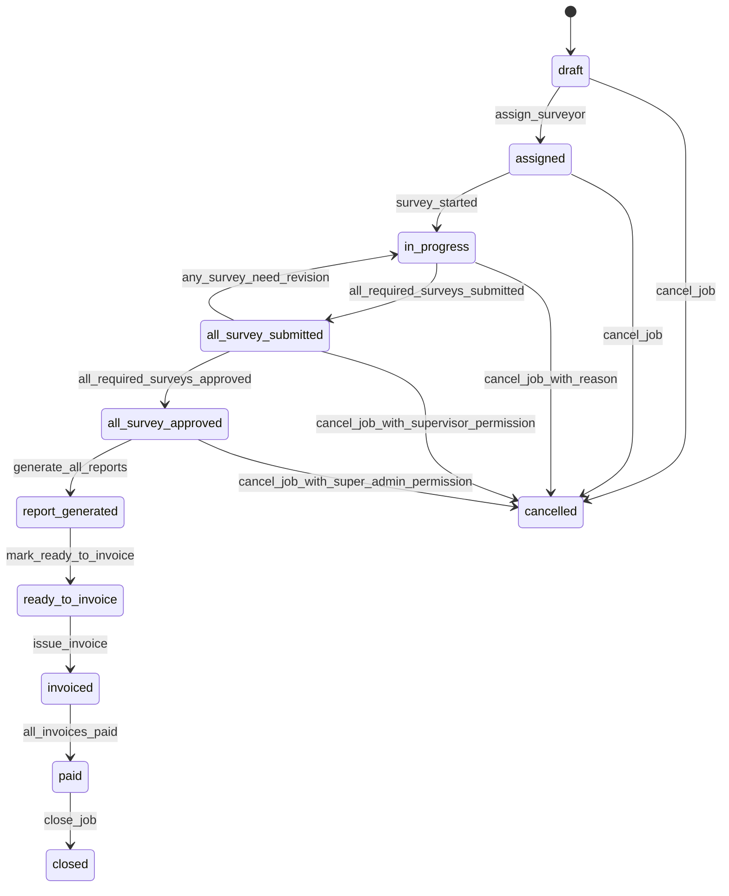

## 5.3 Transition Job Order

| Dari | Action | Actor | Guard | Ke | Side Effect |
|---|---|---|---|---|---|
| `draft` | `assign_surveyor` | Admin/Super Admin | Job punya minimal 1 container | `assigned` | Buat assignment no, update container assigned |
| `assigned` | `survey_started` | Surveyor/System | Survey no dibuat untuk minimal 1 container | `in_progress` | Update progress job |
| `in_progress` | `all_required_surveys_submitted` | System | Semua container wajib status submitted | `all_survey_submitted` | Notifikasi supervisor |
| `all_survey_submitted` | `any_survey_need_revision` | Supervisor/System | Ada survey need revision | `in_progress` | Notifikasi surveyor |
| `all_survey_submitted` | `all_required_surveys_approved` | System | Semua survey wajib approved | `all_survey_approved` | Job masuk tahap report |
| `all_survey_approved` | `generate_all_reports` | Admin/Supervisor/System | Semua survey approved | `report_generated` | Buat report no/PDF |
| `report_generated` | `mark_ready_to_invoice` | System/Admin | Report valid dan belum invoice | `ready_to_invoice` | Muncul di finance |
| `ready_to_invoice` | `issue_invoice` | Finance | Invoice issued | `invoiced` | Link invoice ke report/job |
| `invoiced` | `all_invoices_paid` | System | Semua invoice terkait paid | `paid` | Update finance summary |
| `paid` | `close_job` | Admin/Super Admin/System | Tidak ada outstanding | `closed` | Job dikunci |
| `draft/assigned/in_progress` | `cancel_job` | Admin/Super Admin | Alasan cancel wajib | `cancelled` | Semua child non-final ikut cancelled bila valid |

## 5.4 Aturan Job Order

1. Job `draft` dapat diedit penuh oleh Admin.
2. Job `assigned` masih dapat ditambah container, tetapi harus ada audit log.
3. Job `in_progress` tidak boleh menghapus container yang sudah punya survey kecuali Super Admin dengan alasan.
4. Job `all_survey_approved` tidak boleh mengubah data teknis survey.
5. Job `closed` bersifat terminal.
6. Job `cancelled` bersifat terminal kecuali Super Admin menjalankan action `reopen_cancelled_job` jika fitur ini diaktifkan.

---

# 6. Job Container State Machine

## 6.1 Daftar State Job Container

| State | Arti |
|---|---|
| `not_started` | Container belum dikerjakan |
| `assigned` | Container sudah ditugaskan ke surveyor |
| `in_progress` | Survey container sedang dikerjakan |
| `draft` | Survey tersimpan draft |
| `submitted` | Survey sudah dikirim untuk review |
| `need_revision` | Survey container perlu revisi |
| `approved` | Survey container disetujui |
| `reported` | Survey container masuk report |
| `invoiced` | Survey/report container sudah ditagih |
| `closed` | Container selesai total |
| `cancelled` | Container dibatalkan dari job |

## 6.2 Diagram Job Container

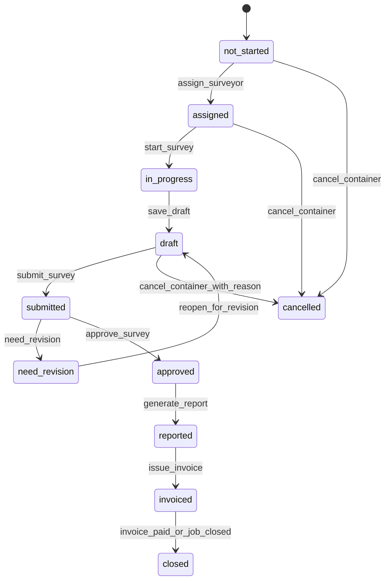

## 6.3 Transition Job Container

| Dari | Action | Actor | Guard | Ke |
|---|---|---|---|---|
| `not_started` | `assign_surveyor` | Admin | Surveyor aktif | `assigned` |
| `assigned` | `start_survey` | Surveyor | Container assigned ke user login | `in_progress` |
| `in_progress` | `save_draft` | Surveyor/System | Survey no ada | `draft` |
| `draft` | `submit_survey` | Surveyor | Validasi submit lolos | `submitted` |
| `submitted` | `need_revision` | Supervisor | Revision note wajib | `need_revision` |
| `need_revision` | `reopen_for_revision` | System | Surveyor membuka survey revisi | `draft` |
| `submitted` | `approve_survey` | Supervisor | Review valid | `approved` |
| `approved` | `generate_report` | System/Admin/Supervisor | Report no dibuat | `reported` |
| `reported` | `issue_invoice` | Finance/System | Invoice issued | `invoiced` |
| `invoiced` | `invoice_paid_or_job_closed` | System | Invoice paid/closed | `closed` |
| Any non-final | `cancel_container` | Admin/Super Admin | Alasan wajib | `cancelled` |

## 6.4 Aturan Job Container

1. Satu job container hanya boleh memiliki satu survey aktif untuk satu survey type.
2. Container yang sudah `submitted` tidak dapat diedit oleh Surveyor kecuali status kembali ke `need_revision` lalu `draft`.
3. Container yang sudah `approved` tidak dapat diedit oleh Surveyor.
4. Container yang `reported`, `invoiced`, atau `closed` tidak boleh dihapus.

---

# 7. Assignment State Machine

## 7.1 Daftar State Assignment

| State | Arti |
|---|---|
| `assigned` | Tugas diberikan ke surveyor |
| `accepted` | Surveyor menerima/membuka tugas |
| `in_progress` | Surveyor mulai mengerjakan minimal satu container |
| `completed` | Semua container assignment selesai approved/reported sesuai aturan |
| `cancelled` | Assignment dibatalkan |
| `reassigned` | Assignment dialihkan ke surveyor lain |

## 7.2 Diagram Assignment

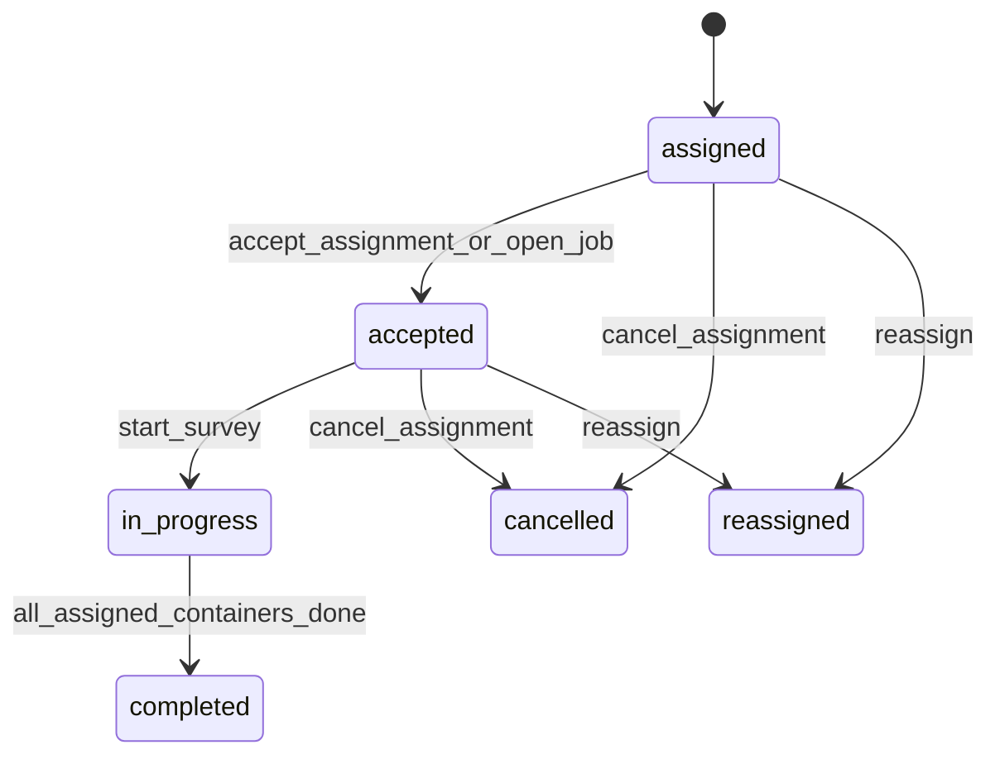

## 7.3 Transition Assignment

| Dari | Action | Actor | Guard | Ke | Side Effect |
|---|---|---|---|---|---|
| `assigned` | `accept_assignment_or_open_job` | Surveyor/System | User adalah surveyor yang ditugaskan | `accepted` | Catat accepted_at |
| `accepted` | `start_survey` | Surveyor | Minimal 1 container mulai survey | `in_progress` | Update job/container |
| `in_progress` | `all_assigned_containers_done` | System | Semua container assignment approved/reported | `completed` | Progress 100% |
| `assigned/accepted` | `reassign` | Admin/Super Admin | Container belum approved | `reassigned` | Buat assignment baru, audit log |
| `assigned/accepted/in_progress` | `cancel_assignment` | Admin/Super Admin | Alasan wajib | `cancelled` | Container bisa kembali not_started/assigned ulang |

## 7.4 Aturan Reassignment

1. Container yang sudah `approved` tidak boleh direassign kecuali Super Admin membuat survey revision khusus.
2. Reassignment harus mencatat surveyor lama, surveyor baru, alasan, dan waktu.
3. Jika survey sudah draft, Admin harus memilih apakah draft dipindahkan atau dibatalkan.

---

# 8. Survey State Machine

## 8.1 Daftar State Survey

| State | Arti |
|---|---|
| `draft` | Survey sedang diisi, belum submit |
| `submitted` | Survey dikirim ke Supervisor |
| `need_revision` | Supervisor meminta revisi |
| `approved` | Survey disetujui |
| `rejected` | Survey ditolak dan tidak digunakan |
| `report_generated` | Report final sudah dibuat |
| `cancelled` | Survey dibatalkan |

## 8.2 Diagram Survey

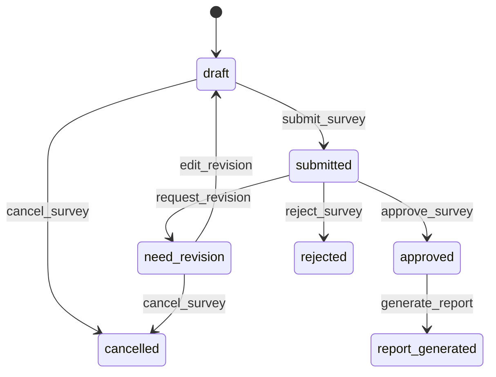

## 8.3 Transition Survey

| Dari | Action | Actor | Guard | Ke | Side Effect |
|---|---|---|---|---|---|
| None | `start_survey` | Surveyor | Container assigned ke surveyor | `draft` | Buat survey_no, update container in_progress |
| `draft` | `save_draft` | Surveyor/System | User pemilik survey | `draft` | Update updated_at |
| `draft` | `submit_survey` | Surveyor | Validasi submit lolos | `submitted` | Lock edit, notifikasi supervisor |
| `submitted` | `request_revision` | Supervisor | Revision note wajib | `need_revision` | Unlock untuk surveyor, notifikasi |
| `need_revision` | `edit_revision` | Surveyor | Survey assigned ke surveyor | `draft` | Catat revision cycle |
| `submitted` | `approve_survey` | Supervisor | Review valid | `approved` | Lock survey, buat approval record |
| `submitted` | `reject_survey` | Supervisor | Rejection reason wajib | `rejected` | Survey tidak masuk invoice/report |
| `approved` | `generate_report` | Supervisor/Admin/System | Report belum dibuat | `report_generated` | Buat report_no dan PDF |
| `draft/need_revision` | `cancel_survey` | Admin/Super Admin | Alasan wajib | `cancelled` | Update container jika perlu |

## 8.4 Guard Submit Survey

Survey hanya dapat `submitted` jika:

1. General info wajib lengkap.
2. Checklist wajib sesuai survey type sudah lengkap.
3. Semua damage memiliki `component_code`.
4. Semua damage memiliki `damage_code`.
5. Semua damage memiliki location.
6. Damage major/critical memiliki ukuran minimal sesuai aturan.
7. Semua damage memiliki minimal satu foto jika `photo_required = true`.
8. Seal no terisi jika cargo status `laden`, kecuali ada override reason.
9. Survey result terisi atau dapat direkomendasikan sistem.
10. Surveyor adalah pemilik assignment/container.

## 8.5 Guard Approve Survey

Survey hanya dapat `approved` jika:

1. Status saat ini `submitted`.
2. Actor adalah Supervisor/Super Admin.
3. Data survey dapat dibuka dan lengkap.
4. Foto damage tersedia.
5. Final result dipilih.
6. Jika critical damage, supervisor mengonfirmasi kesimpulan.

## 8.6 Aturan Editing Survey

| Status | Surveyor Bisa Edit? | Admin Bisa Edit? | Supervisor Bisa Edit? |
|---|---:|---:|---:|
| `draft` | Ya | Tidak langsung | Tidak langsung |
| `submitted` | Tidak | Tidak | Review saja |
| `need_revision` | Ya | Tidak langsung | Review note |
| `approved` | Tidak | Tidak | Tidak langsung |
| `report_generated` | Tidak | Tidak | Tidak, gunakan report revision |
| `rejected` | Tidak | Tidak | Tidak, kecuali reopen khusus |
| `cancelled` | Tidak | Tidak | Tidak |

---

# 9. Survey Damage State Machine

## 9.1 Daftar State Survey Damage

| State | Arti |
|---|---|
| `draft` | Damage dibuat saat survey draft |
| `completed` | Damage memiliki data wajib dan foto jika required |
| `submitted` | Damage ikut terkunci saat survey submitted |
| `approved` | Damage disetujui bersama survey |
| `revision_required` | Damage perlu perbaikan |
| `deleted` | Damage dihapus secara soft delete |
| `void` | Damage dibatalkan tetapi disimpan untuk audit |

## 9.2 Diagram Damage

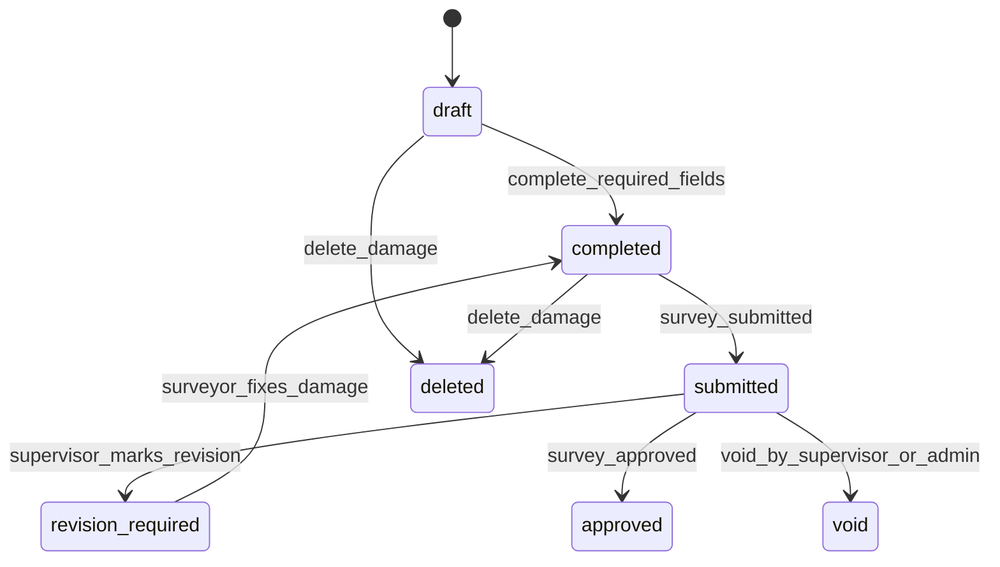

## 9.3 Transition Damage

| Dari | Action | Actor | Guard | Ke |
|---|---|---|---|---|
| None | `create_damage` | Surveyor | Survey `draft/need_revision` | `draft` |
| `draft` | `complete_required_fields` | Surveyor/System | Component + damage type + location valid | `completed` |
| `completed` | `survey_submitted` | System | Survey submit valid | `submitted` |
| `submitted` | `supervisor_marks_revision` | Supervisor | Revision note ada | `revision_required` |
| `revision_required` | `surveyor_fixes_damage` | Surveyor | Data diperbaiki | `completed` |
| `submitted` | `survey_approved` | System | Survey approved | `approved` |
| `draft/completed` | `delete_damage` | Surveyor | Survey belum submitted | `deleted` |
| `submitted/approved` | `void_damage` | Supervisor/Super Admin | Alasan wajib | `void` |

## 9.4 Aturan Damage

1. Damage menggunakan soft delete, bukan hard delete.
2. Damage no tidak dipakai ulang setelah damage dihapus.
3. Damage `approved` tidak dapat diedit; koreksi dilakukan via report/survey revision.
4. Damage major/critical wajib foto dan ukuran.

---

# 10. Survey Photo / File Upload State Machine

## 10.1 Daftar State File Upload

| State | Arti |
|---|---|
| `selected` | File dipilih di frontend |
| `uploading` | File sedang dikirim ke backend/storage |
| `uploaded` | File berhasil disimpan |
| `processing` | File sedang diproses, misalnya watermark/compress |
| `ready` | File siap digunakan di survey/report |
| `failed` | Upload/proses gagal |
| `deleted` | File dihapus secara soft delete |

## 10.2 Diagram File Upload

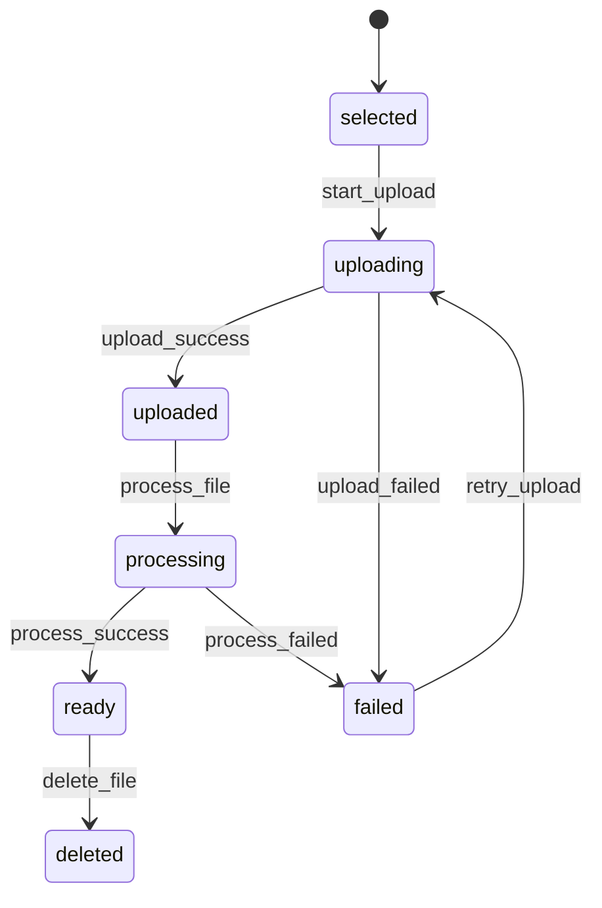

## 10.3 Transition File Upload

| Dari | Action | Actor/System | Guard | Ke |
|---|---|---|---|---|
| `selected` | `start_upload` | User/System | File type valid | `uploading` |
| `uploading` | `upload_success` | System | Storage path tersedia | `uploaded` |
| `uploading` | `upload_failed` | System | Error upload | `failed` |
| `failed` | `retry_upload` | User/System | Retry limit belum lewat | `uploading` |
| `uploaded` | `process_file` | Queue/System | Perlu watermark/compress | `processing` |
| `processing` | `process_success` | Queue/System | Output file valid | `ready` |
| `processing` | `process_failed` | Queue/System | Error process | `failed` |
| `ready` | `delete_file` | User/Admin | Permission valid | `deleted` |

## 10.4 Aturan Foto Survey

1. Foto damage harus memiliki `damage_id`.
2. Foto umum boleh hanya memiliki `survey_id`.
3. Foto yang belum `ready` tidak boleh muncul di report final.
4. Pada web MVP, watermark dapat optional; pada mobile phase, watermark wajib untuk foto lapangan.
5. File yang `deleted` tidak tampil, tetapi metadata tetap tersimpan.

---

# 11. Review / Approval State Machine

## 11.1 Daftar State Approval Record

| State | Arti |
|---|---|
| `pending` | Survey menunggu review |
| `revision_requested` | Supervisor meminta revisi |
| `approved` | Survey disetujui |
| `rejected` | Survey ditolak |
| `superseded` | Approval digantikan oleh approval/revisi baru |

## 11.2 Diagram Approval

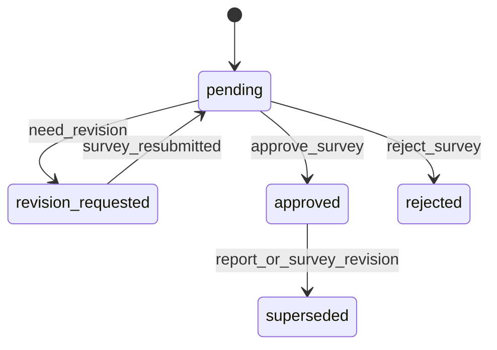

## 11.3 Aturan Approval

1. Setiap submit membuat atau mengaktifkan approval record `pending`.
2. Need revision wajib menyimpan note.
3. Approve wajib menyimpan approver, waktu, dan final result.
4. Reject wajib menyimpan reason.
5. Jika survey direvisi setelah final, approval lama menjadi `superseded`.

---

# 12. Report State Machine

## 12.1 Daftar State Report

| State | Arti |
|---|---|
| `pending_generation` | Report siap dibuat, belum diproses |
| `generating` | PDF sedang dibuat |
| `generated` | PDF berhasil dibuat |
| `failed` | Generate PDF gagal |
| `finalized` | Report final dan terkunci |
| `superseded` | Digantikan oleh versi baru |
| `void` | Report dibatalkan |

## 12.2 Diagram Report

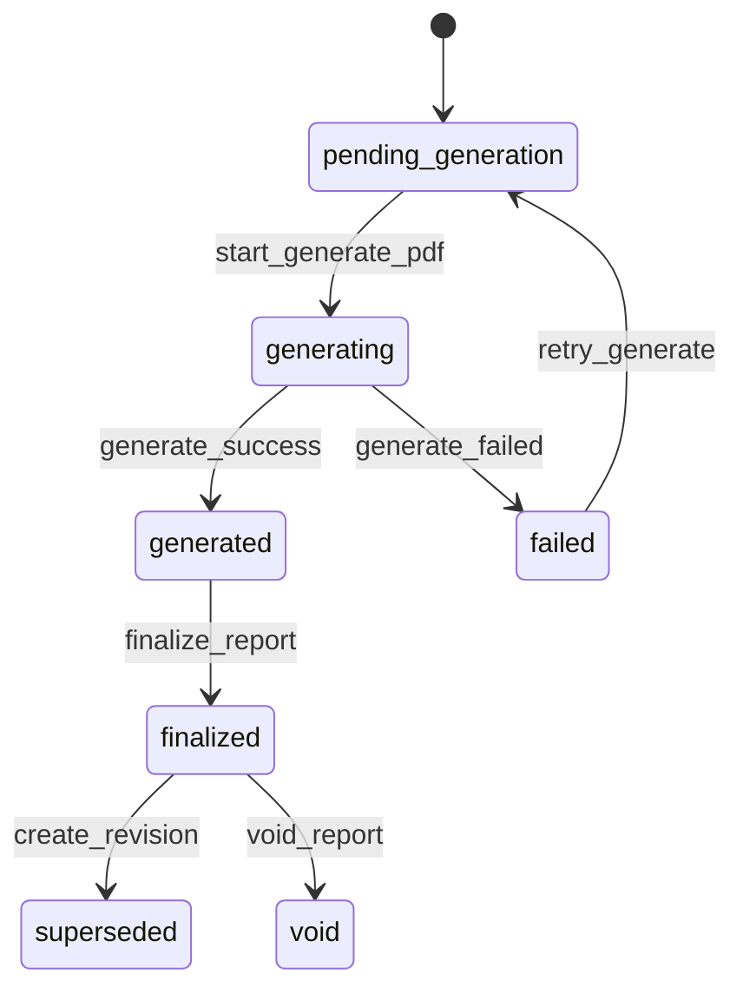

## 12.3 Transition Report

| Dari | Action | Actor/System | Guard | Ke | Side Effect |
|---|---|---|---|---|---|
| None | `create_report_record` | System | Survey approved | `pending_generation` | Buat report_no |
| `pending_generation` | `start_generate_pdf` | System/Queue | Data survey lengkap | `generating` | Queue PDF job |
| `generating` | `generate_success` | System/Queue | PDF tersimpan | `generated` | Simpan file path |
| `generating` | `generate_failed` | System/Queue | Error PDF | `failed` | Simpan error message |
| `failed` | `retry_generate` | Admin/Supervisor/System | Retry valid | `pending_generation` | Queue ulang |
| `generated` | `finalize_report` | Supervisor/Admin/System | PDF valid | `finalized` | QR aktif, ready invoice |
| `finalized` | `create_revision` | Supervisor/Super Admin | Alasan revisi wajib | `superseded` | Buat report version baru |
| `finalized` | `void_report` | Super Admin | Alasan wajib, belum invoice atau invoice void | `void` | QR invalid |

## 12.4 Aturan Report

1. Report hanya bisa dibuat dari survey `approved`.
2. Report final tidak boleh ditimpa.
3. Revisi report membuat versi baru: Rev. 1, Rev. 2, dst.
4. Report `finalized` masuk Ready to Invoice.
5. Report yang sudah invoice tidak boleh void tanpa membatalkan invoice lebih dulu.

---

# 13. Report Version State Machine

## 13.1 Daftar State Report Version

| State | Arti |
|---|---|
| `draft` | Versi sedang dibuat |
| `generated` | PDF versi berhasil dibuat |
| `active` | Versi aktif/final terbaru |
| `superseded` | Versi lama digantikan |
| `void` | Versi dibatalkan |

## 13.2 Aturan Versioning

1. Report pertama adalah `Rev. 0`.
2. Versi aktif hanya boleh satu untuk satu report.
3. Jika Rev. 1 aktif, Rev. 0 menjadi `superseded`.
4. File PDF setiap versi tetap disimpan.
5. QR validation harus mengarah ke versi aktif terbaru.

---

# 14. EIR State Machine

## 14.1 Daftar State EIR

| State | Arti |
|---|---|
| `draft` | EIR dibuat, belum final |
| `generated` | EIR PDF berhasil dibuat |
| `finalized` | EIR final dan terkunci |
| `void` | EIR dibatalkan |

## 14.2 Diagram EIR

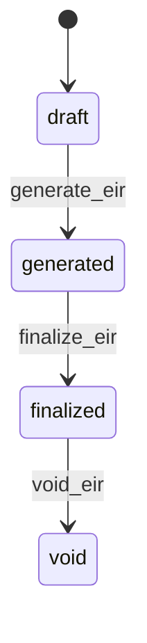

## 14.3 Aturan EIR

1. EIR dibuat untuk Gate In/Gate Out jika `eir_required = true`.
2. EIR dapat mengambil data dari job, container, survey, damage, dan handover party.
3. EIR final tidak boleh diedit langsung.
4. Void EIR wajib alasan.

---

# 15. Invoice State Machine

## 15.1 Daftar State Invoice

| State | Arti |
|---|---|
| `draft` | Invoice dibuat tetapi belum diterbitkan |
| `issued` | Invoice resmi diterbitkan |
| `unpaid` | Invoice issued dan belum dibayar |
| `partial_paid` | Invoice dibayar sebagian |
| `paid` | Invoice lunas |
| `overdue` | Invoice belum lunas melewati due date |
| `cancelled` | Invoice dibatalkan |
| `void` | Invoice dibatalkan secara akuntansi setelah issued |

## 15.2 Diagram Invoice

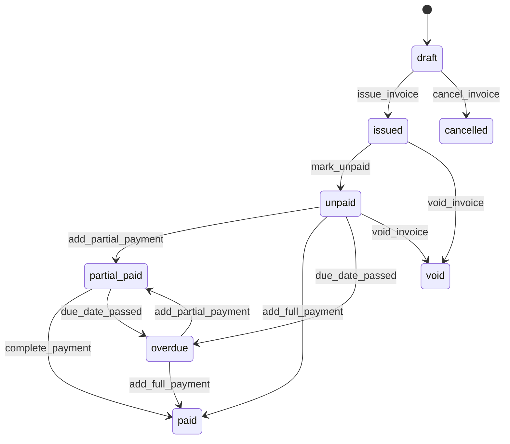

## 15.3 Transition Invoice

| Dari | Action | Actor | Guard | Ke | Side Effect |
|---|---|---|---|---|---|
| None | `create_invoice` | Finance | Ada report ready invoice | `draft` | Buat invoice_no opsional saat save/issue |
| `draft` | `issue_invoice` | Finance | Item valid, total valid | `issued` | Invoice no final, PDF invoice optional |
| `issued` | `mark_unpaid` | System | Grand total belum dibayar | `unpaid` | Update AR |
| `unpaid` | `add_partial_payment` | Finance | Payment < outstanding | `partial_paid` | Buat payment record |
| `unpaid` | `add_full_payment` | Finance | Payment >= outstanding | `paid` | Update report/job paid jika semua lunas |
| `partial_paid` | `complete_payment` | Finance | Outstanding = 0 | `paid` | Update finance summary |
| `unpaid/partial_paid` | `due_date_passed` | System | Today > due_date | `overdue` | Notifikasi finance |
| `overdue` | `add_payment` | Finance | Payment valid | `partial_paid/paid` | Update outstanding |
| `draft` | `cancel_invoice` | Finance | Alasan wajib | `cancelled` | Report kembali ready invoice |
| `issued/unpaid/partial_paid` | `void_invoice` | Finance/Super Admin | Alasan wajib | `void` | Payment handling sesuai aturan |

## 15.4 Aturan Invoice

1. Invoice hanya dapat dibuat dari report `finalized` atau job `ready_to_invoice`.
2. Satu report tidak boleh masuk lebih dari satu invoice aktif, kecuali invoice tambahan/manual adjustment dengan alasan.
3. Invoice `paid` tidak boleh dibatalkan oleh Finance biasa.
4. Invoice `void` harus menyimpan alasan dan actor.
5. Invoice item tidak boleh mengubah data teknis survey.

---

# 16. Payment State Machine

## 16.1 Daftar State Payment

| State | Arti |
|---|---|
| `draft` | Payment dicatat sementara |
| `posted` | Payment resmi mengurangi outstanding |
| `reversed` | Payment dibalik/dibatalkan |
| `void` | Payment void karena salah input |

## 16.2 Diagram Payment

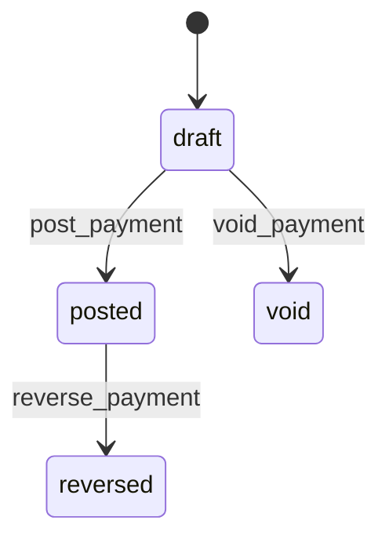

## 16.3 Aturan Payment

1. Payment posted tidak boleh dihapus.
2. Jika salah input, gunakan `reverse_payment` atau `void_payment` sesuai status.
3. Payment posted memperbarui status invoice.
4. Payment proof file optional, tetapi direkomendasikan.
5. Payment amount tidak boleh nol atau negatif.

---

# 17. Notification State Machine

## 17.1 Daftar State Notification

| State | Arti |
|---|---|
| `created` | Notifikasi dibuat |
| `sent` | Notifikasi terkirim |
| `read` | User membaca notifikasi |
| `failed` | Pengiriman gagal |
| `archived` | Notifikasi diarsipkan |

## 17.2 Diagram Notification

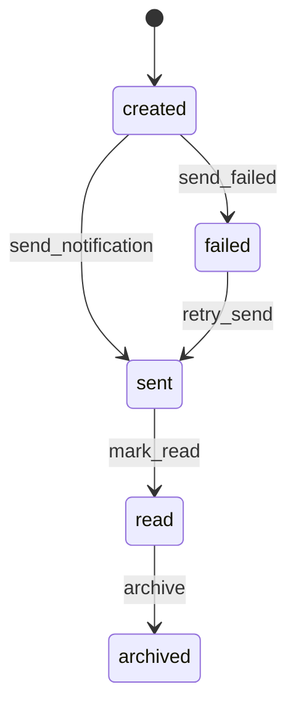

## 17.3 Event yang Memicu Notification

| Event | Penerima |
|---|---|
| Job assigned | Surveyor |
| Survey submitted | Supervisor |
| Survey need revision | Surveyor |
| Survey approved | Admin, Finance |
| Report generated | Admin, Finance |
| Invoice issued | Finance/Admin |
| Payment overdue | Finance |
| Job cancelled | Surveyor/Supervisor/Finance terkait |

---

# 18. Future Mobile Sync State Machine

## 18.1 Daftar State Mobile Sync Item

| State | Arti |
|---|---|
| `local_draft` | Data tersimpan lokal di mobile |
| `queued` | Data siap dikirim ke server |
| `syncing` | Data sedang dikirim |
| `synced` | Data berhasil masuk server |
| `failed` | Sync gagal |
| `conflict` | Data lokal konflik dengan server |
| `discarded` | Data lokal dibuang oleh user/sistem |

## 18.2 Diagram Mobile Sync

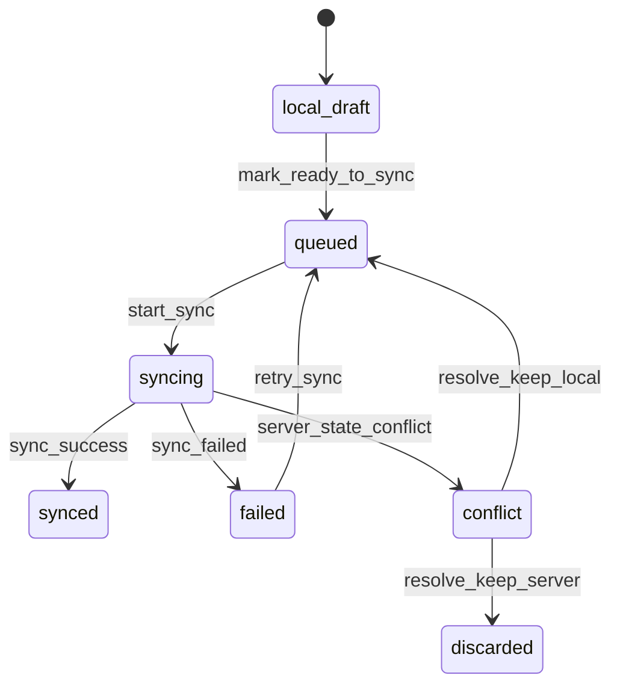

## 18.3 Aturan Mobile Sync

1. Data lokal tidak boleh menimpa survey server yang sudah `submitted`, `approved`, atau `report_generated`.
2. Jika server status sudah lebih maju, sync item masuk `conflict`.
3. Foto local queue dapat retry otomatis.
4. Submit offline hanya boleh menjadi `queued_submit`; status server berubah setelah sync sukses.
5. Setiap sync harus idempotent menggunakan `client_request_id`.

---

# 19. Cross-Entity Status Propagation

## 19.1 Survey ke Job Container

| Survey State | Job Container State |
|---|---|
| `draft` | `draft` / `in_progress` |
| `submitted` | `submitted` |
| `need_revision` | `need_revision` |
| `approved` | `approved` |
| `report_generated` | `reported` |
| `rejected` | `cancelled` atau status khusus sesuai keputusan |

## 19.2 Job Container ke Job Order

| Kondisi Child Container | Job Order State |
|---|---|
| Semua belum mulai | `assigned` |
| Minimal satu in_progress/draft | `in_progress` |
| Semua wajib submitted | `all_survey_submitted` |
| Ada need_revision | `in_progress` |
| Semua approved | `all_survey_approved` |
| Semua report generated | `report_generated` |
| Report siap tagih | `ready_to_invoice` |
| Invoice issued | `invoiced` |
| Invoice paid semua | `paid` |
| Admin close | `closed` |

## 19.3 Report ke Finance

| Report State | Finance Visibility |
|---|---|
| `pending_generation` | Tidak tampil di Ready to Invoice |
| `generating` | Tidak tampil di Ready to Invoice |
| `generated` | Bisa ditinjau, belum final jika belum finalized |
| `finalized` | Tampil di Ready to Invoice |
| `failed` | Tampil di error report queue |
| `superseded` | Tidak bisa invoice baru |
| `void` | Tidak bisa invoice |

## 19.4 Invoice ke Job Order

| Invoice State | Job Order Effect |
|---|---|
| `draft` | Job tetap `ready_to_invoice` |
| `issued/unpaid` | Job menjadi `invoiced` |
| `partial_paid` | Job tetap `invoiced` |
| `paid` | Jika semua invoice paid, job menjadi `paid` |
| `cancelled/void` | Job kembali `ready_to_invoice` jika tidak ada invoice aktif |

---

# 20. Action-to-API Mapping

## 20.1 Job Action Mapping

| Action | Endpoint | Expected State Change |
|---|---|---|
| `create_job` | `POST /api/jobs` | None → `draft` |
| `assign_surveyor` | `POST /api/jobs/{id}/assign` | `draft` → `assigned` |
| `cancel_job` | `POST /api/jobs/{id}/cancel` | Any valid → `cancelled` |

## 20.2 Survey Action Mapping

| Action | Endpoint | Expected State Change |
|---|---|---|
| `start_survey` | `POST /api/surveys/start` | None → `draft` |
| `save_general_info` | `PUT /api/surveys/{id}/general-info` | `draft` stays `draft` |
| `save_checklist` | `PUT /api/surveys/{id}/checklist` | `draft` stays `draft` |
| `submit_survey` | `POST /api/surveys/{id}/submit` | `draft` → `submitted` |
| `approve_survey` | `POST /api/reviews/{survey_id}/approve` | `submitted` → `approved` |
| `need_revision` | `POST /api/reviews/{survey_id}/need-revision` | `submitted` → `need_revision` |
| `reject_survey` | `POST /api/reviews/{survey_id}/reject` | `submitted` → `rejected` |

## 20.3 Report Action Mapping

| Action | Endpoint | Expected State Change |
|---|---|---|
| `generate_report` | `POST /api/reports/generate/{survey_id}` | None/`pending_generation` → `generating/generated` |
| `download_report` | `GET /api/reports/{id}/download` | No state change |
| `validate_report` | `GET /api/reports/validate/{qr_token}` | No state change |

## 20.4 Finance Action Mapping

| Action | Endpoint | Expected State Change |
|---|---|---|
| `create_invoice` | `POST /api/finance/invoices` | None → `draft` |
| `issue_invoice` | `POST /api/finance/invoices/{id}/issue` | `draft` → `issued/unpaid` |
| `add_payment` | `POST /api/finance/payments` | `unpaid/partial/overdue` → recalculated |
| `cancel_invoice` | `POST /api/finance/invoices/{id}/cancel` | `draft/unpaid` → `cancelled/void` |

---

# 21. UI Button Visibility by State

## 21.1 Surveyor Web Buttons

| Survey State | Save Draft | Add Damage | Upload Photo | Submit | Edit |
|---|---:|---:|---:|---:|---:|
| `draft` | Ya | Ya | Ya | Ya | Ya |
| `submitted` | Tidak | Tidak | Tidak | Tidak | Tidak |
| `need_revision` | Ya | Ya | Ya | Ya | Ya |
| `approved` | Tidak | Tidak | Tidak | Tidak | Tidak |
| `report_generated` | Tidak | Tidak | Tidak | Tidak | Tidak |
| `rejected` | Tidak | Tidak | Tidak | Tidak | Tidak |

## 21.2 Supervisor Buttons

| Survey State | Approve | Need Revision | Reject | View Report |
|---|---:|---:|---:|---:|
| `draft` | Tidak | Tidak | Tidak | Tidak |
| `submitted` | Ya | Ya | Ya | Preview only |
| `need_revision` | Tidak | Tidak | Tidak | Tidak |
| `approved` | Tidak | Tidak | Tidak | Generate/View |
| `report_generated` | Tidak | Tidak | Tidak | Ya |

## 21.3 Finance Buttons

| Report/Invoice State | Create Invoice | Issue | Add Payment | Cancel/Void |
|---|---:|---:|---:|---:|
| Report `finalized` | Ya | - | - | - |
| Invoice `draft` | - | Ya | Tidak | Ya |
| Invoice `unpaid` | - | Tidak | Ya | Ya, with reason |
| Invoice `partial_paid` | - | Tidak | Ya | Restricted |
| Invoice `paid` | - | Tidak | Tidak | Super Admin only |

---

# 22. Invalid Transitions

Transition berikut harus ditolak backend:

1. `draft job` → `invoiced` langsung.
2. `draft survey` → `approved` tanpa submit.
3. `submitted survey` diedit langsung oleh Surveyor.
4. `approved survey` diedit oleh Surveyor.
5. `report_generated` survey dikembalikan ke draft tanpa revision mechanism.
6. `report finalized` ditimpa file PDF-nya.
7. `invoice paid` dihapus.
8. `finance` mengubah damage/checklist/photo.
9. `surveyor` melihat job milik surveyor lain.
10. `mobile sync` menimpa survey server yang sudah approved.
11. `cancelled job` dipakai untuk invoice.
12. `rejected survey` masuk report/invoice.

---

# 23. Audit Log Requirements per Transition

Setiap transition berikut wajib masuk audit log:

| Entity | Transition |
|---|---|
| Job Order | create, assign, cancel, close |
| Job Container | assign, start, submit, approve, cancel |
| Assignment | create, accept, reassign, cancel, complete |
| Survey | start, submit, need_revision, approve, reject, cancel |
| Damage | create, edit, delete, void |
| Photo | upload, delete, replace |
| Report | generate, finalize, revise, void |
| Invoice | create, issue, cancel, void |
| Payment | post, reverse, void |
| Permission | create/update/delete role permission |

Audit log minimal menyimpan:

1. `user_id`
2. `action`
3. `entity_type`
4. `entity_id`
5. `old_state`
6. `new_state`
7. `old_value`
8. `new_value`
9. `reason`
10. `ip_address`
11. `user_agent`
12. `created_at`

---

# 24. Backend Implementation Notes

## 24.1 Jangan Update Status Langsung dari Payload

Tidak boleh ada API seperti:

```json
{
  "status": "approved"
}
```

untuk entity penting seperti survey, report, invoice.

Yang benar adalah action endpoint:

```text
POST /api/reviews/{survey_id}/approve
POST /api/reviews/{survey_id}/need-revision
POST /api/finance/invoices/{id}/issue
```

## 24.2 Gunakan Transaction Database

Transition yang mengubah beberapa entity wajib dilakukan dalam database transaction.

Contoh `approve_survey`:

1. Validate survey status = submitted.
2. Insert approval record.
3. Update survey status = approved.
4. Update job_container status = approved.
5. Recalculate job_order status.
6. Create audit log.
7. Commit.

Jika salah satu gagal, rollback semua.

## 24.3 Idempotency

Action berikut sebaiknya idempotent:

1. Submit survey.
2. Upload photo.
3. Generate report.
4. Issue invoice.
5. Mobile sync.

Gunakan `idempotency_key` atau `client_request_id` untuk mencegah double submit.

---

# 25. Testing Matrix State Machine

## 25.1 Survey Testing

| Test | Expected Result |
|---|---|
| Submit survey lengkap | Draft → Submitted |
| Submit survey damage tanpa foto | Ditolak |
| Submit survey checklist belum lengkap | Ditolak |
| Supervisor approve submitted survey | Submitted → Approved |
| Supervisor need revision tanpa note | Ditolak |
| Surveyor edit submitted survey | Ditolak |
| Surveyor edit need_revision survey | Diizinkan |

## 25.2 Report Testing

| Test | Expected Result |
|---|---|
| Generate report dari approved survey | Report generated |
| Generate report dari draft survey | Ditolak |
| Generate report gagal | Status failed, bisa retry |
| Revisi report final | Buat Rev. baru, lama superseded |

## 25.3 Finance Testing

| Test | Expected Result |
|---|---|
| Create invoice dari finalized report | Invoice draft dibuat |
| Create invoice dari unapproved report | Ditolak |
| Issue invoice tanpa item | Ditolak |
| Add partial payment | Invoice partial_paid |
| Add full payment | Invoice paid |
| Delete paid invoice | Ditolak |

## 25.4 Job Propagation Testing

| Test | Expected Result |
|---|---|
| Satu container mulai survey | Job assigned → in_progress |
| Semua survey submitted | Job → all_survey_submitted |
| Salah satu need revision | Job → in_progress |
| Semua approved | Job → all_survey_approved |
| Semua report generated | Job → report_generated/ready_to_invoice |
| Invoice paid semua | Job → paid/closed |

---

# 26. Checklist Kelengkapan State Machine

| Area | Status |
|---|---|
| Job Order states | Sudah dicakup |
| Job Container states | Sudah dicakup |
| Assignment states | Sudah dicakup |
| Survey states | Sudah dicakup |
| Damage states | Sudah dicakup |
| Photo/File upload states | Sudah dicakup |
| Approval states | Sudah dicakup |
| Report states | Sudah dicakup |
| Report versioning | Sudah dicakup |
| EIR states | Sudah dicakup |
| Invoice states | Sudah dicakup |
| Payment states | Sudah dicakup |
| Notification states | Sudah dicakup |
| Future mobile sync states | Sudah dicakup |
| Cross-entity propagation | Sudah dicakup |
| API action mapping | Sudah dicakup |
| UI button visibility | Sudah dicakup |
| Invalid transitions | Sudah dicakup |
| Audit log per transition | Sudah dicakup |
| Backend implementation notes | Sudah dicakup |
| Testing matrix | Sudah dicakup |

---

# 27. Catatan Akhir

State machine ini harus dianggap sebagai aturan inti aplikasi. Jika ada developer yang ingin mengubah status entity, perubahan tersebut harus mengikuti action, guard, permission, side effect, dan audit log yang didefinisikan dalam dokumen ini.

Keputusan penting:

```text
Frontend tidak mengatur status final.
Frontend hanya memicu action.
Backend memvalidasi action.
Backend mengubah state.
Backend mencatat audit log.
Backend melakukan propagation ke parent/child entity.
```

Dengan aturan ini, alur dari Job Order → Survey → Review → Report → Invoice → Payment dapat berjalan konsisten, aman, dan siap dikembangkan ke Mobile Surveyor App pada fase berikutnya.
